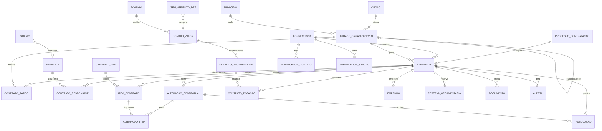

# Plano de refatoração — API e modelo de dados contratual

Data: 2026-08-04  
Status: proposto  
Escopo: redesenho do modelo relacional, das regras de integridade legal, da camada analítica e da superfície HTTP da API, com base em `plan/database-renew/*`  
Base legal: Lei Federal nº 14.133/2021 · Decreto Estadual PR nº 10.086/2022  
Relacionado: [database-renew/](./database-renew/) · [2026-08-03_backend_stabilization.md](./2026-08-03_backend_stabilization.md) · [tech_debt_2026-08-03.md](./tech_debt_2026-08-03.md) · plano de frontend em [apps/web/plan/2026-08-04_frontend_refatoracao_contratual.md](../../web/plan/2026-08-04_frontend_refatoracao_contratual.md)

---

## 1. Objetivo

Transformar o painel de um CRUD genérico de contratos em um **Centro de Inteligência Contratual**: uma base normalizada onde o dado nasce validado no formulário, os relacionamentos permitem reaproveitamento total em listas suspensas, e a linha do tempo contratual (aditivos + apostilamentos) é derivada — nunca digitada.

O modelo precisa responder, sem cálculo manual, às perguntas de `perguntas_insights.md`:

| # | Pergunta de negócio | Onde é respondida no modelo alvo |
|---|---|---|
| 1 | Quantos contratos a SESP tem, por força (FSP) e por unidade | `Contrato` → `UnidadeOrganizacional` → `Orgao` |
| 2 | Quais vencem em 30/60/90/120 dias | `vw_contrato_vigencia.diasAteVencimento` |
| 3 | Quais estão no último aditivo de prorrogação possível | `vw_contrato_limites_legais.prazoRestanteMeses` |
| 4 | Quantos aditivos um contrato possui e qual o impacto financeiro | `AlteracaoContratual` + `vw_contrato_financeiro` |
| 5 | Contratos/aditivos/apostilamentos publicados (e quais não) | `Publicacao` + `vw_contrato_publicidade` |
| 6 | Valor total sob gestão e % já aditado | `vw_contrato_financeiro.valorGlobalAtualizadoCents` |
| 7 | Quem pagou (Tesouro, FUNESP, FUNSUSP, emenda parlamentar) | `FonteRecurso` ← `DotacaoOrcamentaria` ← `ContratoDotacao` |
| 8 | Custo por natureza de despesa (material permanente vs serviço continuado) | `NaturezaDespesa` + `Contrato.naturezaObjeto` |
| 9 | Quantidade de objeto contratado (viaturas, kits APH, bastão retrátil, coldre) | `CatalogoItem` ← `ItemContrato` |
| 10 | Locação vs aquisição de frota; caracterizada vs descaracterizada | `ItemContrato.atributos` + `mv_kpi_frota` |
| 11 | Custo por m² de imóvel locado | `ItemContrato` (metragem) + `mv_kpi_imoveis` |
| 12 | Postos de trabalho por unidade e custo anual | `ItemContrato` (posto) + `ContratoRateio` |
| 13 | Concentração de fornecedores | `mv_kpi_fornecedor_concentracao` |
| 14 | Carga de trabalho por gestor/fiscal | `ContratoResponsavel` + `mv_kpi_carga_fiscal` |
| 15 | Distribuição por modalidade (quantidade e valor) | `DominioValor('modalidade-licitacao')` |
| 16 | Evolução vs projeção / renovação previsível | `ProcessoContratacao` + `mv_kpi_evolucao_aditivos` |

---

## 2. Leitura crítica dos documentos base

Os quatro documentos formam uma base estrutural sólida. Abaixo, o que aproveito integralmente e o que precisa ser corrigido antes de virar schema.

### 2.1 O que aproveito

- **Três pilares orçamentários** (`CUSTEIO`, `INVESTIMENTO`, `SERVIÇOS`) como dimensão de primeira classe — força metadado específico por natureza de despesa.
- **`ALTERAÇÃO_CONTRATUAL` como log de eventos**, não sobrescrita do contrato (JSON_ref, item 3). É a decisão mais importante do documento e é a base da linha do tempo.
- **`ITEM_CONTRATO` com `categoria_item`** (mermaid) em vez de uma tabela por tipo de objeto.
- **`DOTACAO_FINANCEIRA` separada do contrato** (mermaid), com empenho/natureza/fonte.
- **`SERVIDOR` como entidade** (mermaid), substituindo texto livre `"CHRIS (G)"`.
- **Materialized views para performance de dashboard** (fluxo_dashboard) — painel do diretor às 08h carrega instantâneo.
- **Painéis segregados** (tático do fiscal vs estratégico do secretário).
- **Alertas precoces de 60/90/120 dias** como requisito de primeira classe, não relatório.

### 2.2 O que precisa ser corrigido (normalização e cruzamento)

| # | Problema no documento | Por que é problema | Correção adotada |
|---|---|---|---|
| N1 | `DIAS_ATÉ_VENCIMENTO`, `DATA_ÚLTIMO_ADITIVO`, `CUSTO_TOTAL_ADITADO`, `CUSTO_MENSAL/ANUAL/TOTAL` armazenados | Campos calculados persistidos apodrecem: `DIAS_ATÉ_VENCIMENTO: 57` está errado no dia seguinte. O JSON já mostra inconsistências (`DATA_FIM_VIGÊNCIA` anterior a `DATA_ÚLTIMO_ADITIVO`, `DIAS_ATÉ_VENCIMENTO: -8` com status `VENCIDO-ADITADO`) | **Nada calculado é armazenado.** Derivação em views (transacional) + materialized views (agregado) |
| N2 | `STATUS: "VIGENTE-ADITADO"`, `"VENCIDO-ADITADO"` | Conflata duas dimensões ortogonais: estado de vigência (derivado de datas) × existência de aditivo (derivado de `count`). Gera explosão combinatória de status | `Contrato.situacao` (enum declarado por ato humano) + `vw_contrato_vigencia.situacaoEfetiva` (derivada) + `qtdAditivos` como número |
| N3 | `UNIDADE_FSP` + `SUBUNIDADE` + `MUNICÍPIO` como três strings na mesma linha | Hierarquia organizacional achatada; `"33º BPM - CURITIBA"` mistura unidade e município no mesmo campo; impossível agregar por nível | `Orgao` → `UnidadeOrganizacional` (auto-relacionada, N níveis) → `Municipio` (código IBGE) |
| N4 | Contrato tem **uma** `UNIDADE_FSP`, mas o texto exige "rateio por Unidades e Subunidades" | Requisito de rateio é incompatível com FK 1:N | `Contrato.unidadeGestoraId` (responsável) + `ContratoRateio` (N:N com % ou valor) |
| N5 | `GESTOR_INDICADO`/`FISCAL_INDICADO` como texto e 1:1 | A Lei 14.133 art. 117 prevê fiscalização técnica, administrativa e setorial — múltiplos fiscais. Além disso, designação muda ao longo do contrato (portaria) | `ContratoResponsavel` (N:N `Contrato`×`Servidor`) com `papel`, `atoDesignacao`, `dataInicio`, `dataFim` |
| N6 | `EMPRESA` (string) no JSON; `FORNECEDOR` no mermaid | No código atual isso virou **duas tabelas duplicadas**: `Empresa(cnpj, razaoSocial)` ligada ao contrato e `Fornecedor(cnpj, nome)` órfã. Mesma entidade, dois cadastros, dois CNPJs únicos | Unificar em **`Fornecedor`** (pessoa jurídica ou física), com `Empresa` removida |
| N7 | Um "grupo" de campos por subtipo (`QTD_VEIC_AQUIS`, `TIPO_ALIMENT`, `NOME_POSTO`, `METRAGEM(m2)`…) no mesmo objeto | 8 subtipos × ~10 campos = tabela larga e esparsa (o JSON já tem `QTD_VEIC_AQUIS: null` em contrato de imóvel e `TIPO_VEÍCULO_AQUIS: "PRÉDIO"`, campo sendo usado fora do domínio) | `ItemContrato` com colunas comuns + `atributos JSONB` governado por `ItemAtributoDef` (registro de metadados que também dirige o formulário dinâmico no front) |
| N8 | Objeto contratado como texto livre (`"FUZIL RQK2A"`, `"FEIJÃO"`, `"PEDREIRO"`) | Impede responder "quantidade de objeto contratado" e destrói o reaproveitamento em listas suspensas | `CatalogoItem` (catálogo normalizado, reutilizável, com unidade de medida) |
| N9 | `MODALIDADE_LICITAÇÃO` sem fundamento legal | Dispensa e inexigibilidade exigem o inciso (art. 75, art. 74). Sem isso não há auditoria de legalidade | `Contrato.fundamentoLegalId` → `DominioValor('fundamento-legal')` |
| N10 | `termo_apostilamento: []` vazio, sem estrutura | Apostilamento (art. 136) é o instrumento mais frequente (reajuste, reequilíbrio, troca de dotação, troca de fiscal) e **não** é aditivo | Tabela única `AlteracaoContratual` com enum `tipo` cobrindo aditivos **e** apostilamentos |
| N11 | Publicação não modelada, mas há 3 perguntas sobre ela | Publicidade no PNCP é condição de eficácia (art. 94). Um booleano não basta: precisa veículo, data, número do PNCP | `Publicacao` (polimórfica controlada: contrato ou alteração) |
| N12 | `NOTA_RESERVA`, `DOTAÇÃO_ORÇAMENTÁRIA`, `NUM_NATUREZA_DESPESA` como strings no contrato; "QUEM PAGOU?" sem resposta | Fonte de recurso (FUNESP/FUNSUSP/emenda/tesouro) é dimensão analítica central e um contrato pode ter múltiplas fontes | `DotacaoOrcamentaria` + `ContratoDotacao` (N:N com valor) + `Empenho` + `ReservaOrcamentaria` |
| N13 | ETL em Airflow como camada de validação (fluxo_dashboard) | Validar a regra dos 25% **fora** do banco permite que dado inválido entre por outra porta | Regra legal em **trigger/constraint no Postgres** + serviço na API. ETL fica só para ingestão de planilhas legadas |
| N14 | `ID_CONTRATO` textual (`"LOC_IMOVEIS-1321/2022"`) como chave | Chave natural composta e frágil; muda se a categoria mudar | `uuid` como PK; `numeroGms`+`anoGms` como chave natural única; o "ID legado" fica em `codigoLegado` para rastreabilidade da migração |
| N15 | `PERÍODO_CONTRATO` + `UNIDADE_TEMPO` sem limite legal | Serviço continuado prorroga até 10 anos (art. 107); não continuado, não. Sem `naturezaObjeto` não há como aplicar o limite | `Contrato.naturezaObjeto` (enum) dirige `limiteProrrogacaoMeses` e o limite de acréscimo (25% / 50%) |
| N16 | Fase preparatória ausente; `perguntas_insights` pede ETP e "renovação previsível" | Sem o processo (art. 18) não se responde "o que está faltando" nem se projeta demanda | `ProcessoContratacao` (e-Protocolo, ETP, TR, valor estimado) como antecessor opcional do contrato |

### 2.3 Bugs de modelagem no código atual (achados durante a análise)

| Severidade | Achado | Impacto |
|---|---|---|
| **Alta** | `Contrato.valorAnualCents Int` — teto de `2.147.483.647` centavos = **R$ 21.474.836,47** | Contrato de aquisição de frota estadual estoura o tipo e falha em runtime. Mesmo problema em `Aditivo.valorAdicionalCents` |
| **Alta** | `Empresa` e `Fornecedor` são a mesma entidade em duas tabelas (N6) | Cadastro duplicado, CNPJ único em dois lugares, dropdown de fornecedor não usa a tabela de fornecedores |
| **Alta** | `Servico` é uma tabela órfã, sem relação com `Contrato` | Cadastro que o usuário preenche e nunca é reaproveitado |
| Média | `numGms Int` | Perde zeros à esquerda e o formato `1313/1313` do GMS |
| Média | `modalidade` e `status` são `TEXT` livre; front usa `vigente\|encerrado\|suspenso`, seed usa `Dispensa`, docs usam `VIGENTE-ADITADO` | Agregação por modalidade/status é impossível de confiar |
| Média | `Municipio` existe no schema, sem API, sem seed, sem FK | Município é string no contrato hoje |
| Média | Auditoria dupla: triggers no Postgres **e** `writeAuditLog` na aplicação | Eventos duplicados em `AuditLog` para `Contrato`/`Aditivo` |
| Média | `packages/schema` importado por caminho relativo (`../../../../packages/schema/src/contracts`) e não como `@painel/schema` | Build frágil; impede compartilhar schema com o front |
| Média | `zod@3.25.76` na API/schema vs `zod@^4.4.3` no `apps/web` | Schemas compartilhados quebram entre os dois lados |
| Baixa | `view_consolidada` existe e nenhum endpoint a consulta | Trabalho de banco não aproveitado |
| Baixa | Todas as rotas sob `/.netlify/functions/api` | Acopla a URL pública ao provedor de deploy |
| Baixa | `PUT /contracts/:id` não sincroniza aditivos | Alteração contratual só é criável junto com o contrato |

---

## 3. Decisões de arquitetura travadas

1. **Nenhum campo derivado é persistido.** Vigência atual, dias até vencimento, valor atualizado, contagem de aditivos, situação efetiva e percentual de acréscimo vivem em views. O documento mermaid sugere trigger para `data_fim_vigencia_atual`; recusamos por N1 e derivamos com `LATERAL JOIN` — o volume (milhares de contratos) não justifica denormalização.
2. **Duas camadas de leitura.** Views normais (`vw_*`) para telas transacionais, sempre frescas. Materialized views (`mv_*`) só para agregados de dashboard, com `refresh_dashboard_views()` agendado e `REFRESH ... CONCURRENTLY`.
3. **Enum nativo para conceito legal estável; tabela de domínio para lista gerenciável pelo usuário.** `PilarOrcamentario`, `TipoAlteracao`, `SituacaoContrato`, `NaturezaObjeto`, `PapelResponsavel`, `UnidadeTempo` são enums Postgres. `modalidade-licitacao`, `fundamento-legal`, `natureza-despesa`, `fonte-recurso`, `unidade-medida`, `categoria-contratacao`, `categoria-item`, `tipo-documento`, `veiculo-publicacao` são `DominioValor` — o usuário cria e reaproveita.
4. **Dinheiro em `BigInt` de centavos.** Nunca `Float`. Serializado em JSON como número (seguro até R$ 90 trilhões, muito abaixo de `Number.MAX_SAFE_INTEGER`), com `BigInt.prototype.toJSON` registrado no bootstrap. Percentuais em `Decimal(7,4)`.
5. **`ItemContrato` híbrido.** Fatos transversais viram coluna com FK (quantidade, unidade de medida, valor unitário, catálogo, unidade destino, município, periodicidade). Fatos específicos de categoria viram `atributos JSONB` validado por Zod derivado de `ItemAtributoDef`, com índice GIN e índices de expressão para os atributos usados em dashboard (`caracterizacao`, `metragemM2`, `tipoVeiculo`).
6. **Regra legal no banco e no serviço.** Limites de acréscimo (art. 125), prazo máximo de prorrogação (art. 106/107) e coerência de datas são validados no serviço (mensagem amigável) **e** em `CHECK`/trigger (garantia). Excepcionar exige `justificativaExcepcional` preenchida.
7. **Auditoria só por trigger.** Remove-se `writeAuditLog` da aplicação; um middleware passa `app.current_user` / `app.current_user_source` via `SET LOCAL` na transação, e os triggers cobrem **todas** as tabelas de domínio (não só `Contrato`/`Aditivo`).
8. **Fornecedor unificado.** `Empresa` é eliminada; `Fornecedor` atende pessoa jurídica e física, com contatos e sanções (art. 156).
9. **Um endpoint de lookups.** `GET /api/v1/lookups` devolve todas as listas suspensas em um payload cacheável (ETag + `Cache-Control`), acabando com o efeito "10 requests para abrir um formulário".
10. **Quick-create em todo cadastro referenciado.** Todo `POST` de entidade de referência devolve o registro no formato de opção (`{ id, label, ... }`) para o combobox inserir sem refetch.
11. **URL pública desacoplada do deploy.** Rotas montadas em `/api/v1/*`, com `/.netlify/functions/api/*` mantido como alias durante a transição.
12. **Camadas explícitas.** `routes → controllers (HTTP) → services (regra) → repositories (Prisma)`. Controller nunca monta `where` de Prisma; service nunca conhece `req`/`res`.
13. **Contrato-primeiro.** Zod em `@painel/schema` é a fonte de verdade; OpenAPI é gerado dele (`zod-to-openapi`) e o front consome os tipos. `zod` alinhado em `3.25.x` nos três pacotes.
14. **Migração sem preservação de dados de produção.** Só existe dado de seed; fazemos corte limpo com migrations Prisma numeradas + script de backfill para o eventual dado legado em planilha (via `ImportacaoLote`).

---

## 4. Modelo de dados alvo

### 4.1 Visão geral



### 4.2 Domínios gerenciáveis (o motor das listas suspensas)

**`Dominio`** — catálogo de listas.

| Campo | Tipo | Notas |
|---|---|---|
| `id` | uuid | |
| `slug` | string | único; ex. `modalidade-licitacao` |
| `nome` | string | rótulo exibido |
| `descricao` | string? | |
| `editavelPeloUsuario` | boolean | `false` para listas com significado legal fixo |
| `permiteHierarquia` | boolean | habilita `parentId` nos valores |

**`DominioValor`** — item de lista, reaproveitado em todo o sistema.

| Campo | Tipo | Notas |
|---|---|---|
| `id` | uuid | |
| `dominioId` | uuid FK | |
| `codigo` | string | estável, usado em regras (`PREGAO_ELETRONICO`) |
| `label` | string | exibição (`Pregão eletrônico`) |
| `parentId` | uuid? | ex. `fundamento-legal` filho de `modalidade` |
| `ordem` | int | ordenação no select |
| `ativo` | boolean | desativar sem apagar histórico |
| `metadata` | jsonb | ex. `{ "pilar": "CUSTEIO", "categoriaItemPadrao": "VEICULO" }` |
| `codigoLegado` | string? | rastreio da migração |

Restrições: `@@unique([dominioId, codigo])`, `@@index([dominioId, ativo, ordem])`.

Domínios semeados:

| Slug | Editável | Valores iniciais |
|---|---|---|
| `modalidade-licitacao` | não | `PREGAO_ELETRONICO`, `CONCORRENCIA`, `CONCURSO`, `LEILAO`, `DIALOGO_COMPETITIVO`, `DISPENSA`, `INEXIGIBILIDADE`, `ADESAO_ARP`, `CREDENCIAMENTO` |
| `fundamento-legal` | sim | `ART_75_I`, `ART_75_II`, `ART_74_I`…`ART_74_V`, `ART_79`, com `parentId` na modalidade |
| `categoria-contratacao` | sim | `LOCACAO_VEICULOS`, `LOCACAO_IMOVEIS`, `GENEROS_ALIMENTICIOS`, `AQUISICAO_VEICULOS`, `AQUISICAO_BENS_TATICOS`, `LOCACAO_MAO_DE_OBRA`, `SERVICO_EVENTUAL`, `FORNECIMENTO_REFEICAO` — `metadata.pilar` amarra ao pilar |
| `categoria-item` | sim | `VEICULO`, `IMOVEL`, `ALIMENTO`, `REFEICAO`, `ARMAMENTO`, `EQUIPAMENTO_TATICO`, `POSTO_TRABALHO`, `SERVICO`, `MATERIAL_CONSUMO` |
| `unidade-medida` | sim | `UN`, `M2`, `M`, `KG`, `L`, `DIA`, `MES`, `POSTO`, `SERVICO`, `KM` |
| `natureza-despesa` | sim | `33903900` (serviços PJ), `44905200` (equipamento/material permanente), `33903000`… |
| `fonte-recurso` | sim | `TESOURO_ESTADO`, `FUNESP`, `FUNSUSP`, `EMENDA_PARLAMENTAR`, `CONVENIO_UNIAO`, `FUNDO_PENITENCIARIO` |
| `veiculo-publicacao` | não | `PNCP`, `DIOE`, `DOU`, `SITE_ORGAO` |
| `tipo-documento` | sim | `CONTRATO_ASSINADO`, `ETP`, `TERMO_REFERENCIA`, `PORTARIA_DESIGNACAO`, `PARECER_JURIDICO`, `NOTA_EMPENHO`, `ATA_RP`, `TERMO_ADITIVO`, `APOSTILA` |
| `destinacao-imovel` | sim | `SEDE_ADMINISTRATIVA`, `DELEGACIA`, `ALOJAMENTO`, `DEPOSITO`, `GARAGEM` |
| `tipo-veiculo` | sim | `SUV`, `SEDAN`, `CAMINHONETE`, `CAMINHAO`, `MOTOCICLETA`, `VAN`, `AMBULANCIA` |

> Decisão: em vez de ~12 tabelas de lookup quase idênticas, uma estrutura genérica com CRUD único, um endpoint único e um componente de front único. Conceitos com atributos e comportamento próprios (fornecedor, servidor, unidade, catálogo, dotação) continuam sendo tabelas reais.

### 4.3 Estrutura organizacional

**`Orgao`** — força de segurança pública / órgão.

| Campo | Tipo | Notas |
|---|---|---|
| `id` | uuid | |
| `sigla` | string | único (`PMPR`, `PCPR`, `CBMPR`, `DEPPEN`, `PCP`, `DETRAN`, `SESP`) |
| `nome` | string | |
| `tipo` | enum `TipoOrgao` | `POLICIA_MILITAR`, `POLICIA_CIVIL`, `BOMBEIROS`, `POLICIA_PENAL`, `POLICIA_CIENTIFICA`, `TRANSITO`, `ADMINISTRACAO_DIRETA` |
| `ativo` | boolean | |

**`UnidadeOrganizacional`** — resolve N3 (unidade + subunidade + município).

| Campo | Tipo | Notas |
|---|---|---|
| `id` | uuid | |
| `orgaoId` | uuid FK | |
| `parentId` | uuid? FK self | hierarquia de N níveis |
| `sigla` | string | `33BPM` |
| `nome` | string | `33º Batalhão de Polícia Militar` |
| `nivel` | enum `NivelUnidade` | `COMANDO_GERAL`, `DIRETORIA`, `COMANDO_REGIONAL`, `BATALHAO`, `COMPANHIA`, `DELEGACIA`, `UNIDADE_PRISIONAL`, `SETOR` |
| `municipioId` | uuid FK | |
| `ativo` | boolean | |

Restrições: `@@unique([orgaoId, sigla])`, `@@index([parentId])`, `@@index([municipioId])`. Trigger `fn_impedir_ciclo_unidade` valida a árvore.

**`Municipio`** — passa a ser usada de verdade.

| Campo | Tipo | Notas |
|---|---|---|
| `id` | uuid | |
| `codigoIbge` | string | único, 7 dígitos |
| `nome` | string | |
| `uf` | string | |
| `regiaoAdministrativa` | string? | |

Seed: os 399 municípios do Paraná (fonte IBGE) + capitais de outras UFs conforme necessidade.

### 4.4 Partes

**`Fornecedor`** — unifica `Empresa` + `Fornecedor` (N6).

| Campo | Tipo | Notas |
|---|---|---|
| `id` | uuid | |
| `tipoPessoa` | enum `TipoPessoa` | `JURIDICA`, `FISICA` |
| `documento` | string | único; só dígitos (CNPJ 14 / CPF 11) |
| `razaoSocial` | string | |
| `nomeFantasia` | string? | |
| `inscricaoEstadual` | string? | |
| `porte` | enum? `PorteEmpresa` | `MEI`, `ME`, `EPP`, `DEMAIS` — relevante para art. 4º |
| `municipioId` | uuid? FK | |
| `situacao` | enum `SituacaoFornecedor` | `ATIVO`, `INATIVO`, `IMPEDIDO`, `INIDONEO` |
| `codigoLegado` | string? | `"EMPRESA 3"` da planilha |

Restrições: `CHECK` de tamanho do documento por `tipoPessoa`; `@@index([razaoSocial])` e índice `pg_trgm` para busca do combobox.

**`FornecedorContato`**: `id`, `fornecedorId`, `nome`, `cargo?`, `email?`, `telefone?`, `principal`.

**`FornecedorSancao`** (art. 156): `id`, `fornecedorId`, `tipo` (`ADVERTENCIA`, `MULTA`, `IMPEDIMENTO_LICITAR`, `DECLARACAO_INIDONEIDADE`), `processo?`, `dataInicio`, `dataFim?`, `abrangencia?`, `fonte?`. Alimenta alerta ao selecionar fornecedor sancionado no formulário.

**`Servidor`** — substitui `EntidadeGestora` (N5).

| Campo | Tipo | Notas |
|---|---|---|
| `id` | uuid | |
| `nome` | string | |
| `cpf` | string? | único quando presente |
| `rgFuncional` | string? | único quando presente |
| `cargo` | string? | |
| `orgaoId` | uuid? FK | |
| `unidadeId` | uuid? FK | |
| `email` | string? | |
| `telefone` | string? | |
| `ativo` | boolean | |

**`ContratoResponsavel`** — designação com papel e período.

| Campo | Tipo | Notas |
|---|---|---|
| `id` | uuid | |
| `contratoId` | uuid FK | cascade |
| `servidorId` | uuid FK | restrict |
| `papel` | enum `PapelResponsavel` | `GESTOR`, `GESTOR_SUBSTITUTO`, `FISCAL_TECNICO`, `FISCAL_ADMINISTRATIVO`, `FISCAL_SETORIAL`, `FISCAL_SUBSTITUTO`, `PREPOSTO_CONTRATADA` |
| `atoDesignacao` | string? | nº da portaria |
| `dataInicio` | date | |
| `dataFim` | date? | nulo = vigente |

Restrições: índice único parcial garantindo **um** `GESTOR` vigente por contrato; trigger impedindo o mesmo servidor como gestor e fiscal simultâneos (substitui o `CHECK chk_gestor_fiscal` atual, que era coluna a coluna); `@@index([servidorId, papel])` para a pergunta de carga de trabalho.

### 4.5 Contrato

**`Contrato`** — cabeça, sem nenhum campo calculado.

| Campo | Tipo | Notas |
|---|---|---|
| `id` | uuid | |
| `processoId` | uuid? FK | `ProcessoContratacao` |
| `numeroGms` | string | preserva `1313/1313`, zeros à esquerda |
| `anoGms` | int | |
| `numeroContrato` | string? | nº do instrumento, se diferente do GMS |
| `eProtocolo` | string? | único |
| `pilar` | enum `PilarOrcamentario` | `CUSTEIO`, `INVESTIMENTO`, `SERVICOS` |
| `categoriaContratacaoId` | uuid FK | `DominioValor('categoria-contratacao')` |
| `naturezaObjeto` | enum `NaturezaObjeto` | `SERVICO_CONTINUADO`, `SERVICO_NAO_CONTINUADO`, `OBRA`, `SERVICO_ENGENHARIA`, `COMPRA`, `LOCACAO_BEM_MOVEL`, `LOCACAO_IMOVEL`, `SOLUCAO_TIC` — dirige limites legais |
| `modalidadeId` | uuid FK | `DominioValor('modalidade-licitacao')` |
| `fundamentoLegalId` | uuid? FK | obrigatório se modalidade ∈ {dispensa, inexigibilidade} |
| `objeto` | text | |
| `fornecedorId` | uuid FK | |
| `unidadeGestoraId` | uuid FK | `UnidadeOrganizacional` |
| `dataAssinatura` | date? | |
| `dataInicioVigencia` | date | |
| `prazoInicialValor` | int | |
| `prazoInicialUnidade` | enum `UnidadeTempo` | `DIAS`, `MESES`, `ANOS` |
| `dataFimVigenciaOriginal` | date | fato imutável — base do cálculo de limites |
| `prorrogavel` | boolean | |
| `limiteProrrogacaoMeses` | int? | default derivado de `naturezaObjeto` |
| `valorGlobalOriginalCents` | bigint | |
| `indiceReajuste` | string? | `IPCA`, `IGPM`, `INPC` |
| `mesAniversarioReajuste` | int? | 1–12 |
| `situacao` | enum `SituacaoContrato` | `EM_ELABORACAO`, `ASSINADO`, `VIGENTE`, `SUSPENSO`, `RESCINDIDO`, `ENCERRADO`, `ANULADO` |
| `dataEncerramento` | date? | |
| `motivoEncerramento` | text? | |
| `garantiaTipo` | enum? `TipoGarantia` | `NENHUMA`, `CAUCAO`, `SEGURO_GARANTIA`, `FIANCA_BANCARIA` |
| `garantiaValorCents` | bigint? | |
| `garantiaValidade` | date? | |
| `reservaObservacao` / `observacoes` | text? | |
| `codigoLegado` | string? | `"LOC_IMOVEIS-1321/2022"` |
| `createdAt`/`updatedAt`/`createdById`/`updatedById` | | |

Restrições e índices:

- `@@unique([numeroGms, anoGms])`
- `CHECK (dataFimVigenciaOriginal > dataInicioVigencia)`
- `CHECK (valorGlobalOriginalCents >= 0)`
- `CHECK (mesAniversarioReajuste BETWEEN 1 AND 12)`
- `@@index([situacao, dataFimVigenciaOriginal])`, `@@index([unidadeGestoraId])`, `@@index([fornecedorId])`, `@@index([pilar, categoriaContratacaoId])`, `@@index([anoGms])`
- Trigger `fn_exigir_fundamento_legal` para dispensa/inexigibilidade

**`ContratoRateio`** — resolve N4.

| Campo | Tipo | Notas |
|---|---|---|
| `id` | uuid | |
| `contratoId` | uuid FK | cascade |
| `unidadeId` | uuid FK | |
| `percentual` | decimal(7,4)? | |
| `valorCents` | bigint? | |
| `quantidade` | decimal(14,4)? | ex. nº de viaturas destinadas |
| `observacao` | text? | |

Restrições: `@@unique([contratoId, unidadeId])`; `CHECK (percentual IS NOT NULL OR valorCents IS NOT NULL)`; trigger `fn_validar_soma_rateio` (soma de percentual ≤ 100, soma de valor ≤ valor global atualizado).

**`ProcessoContratacao`** — fase preparatória (N16).

| Campo | Tipo |
|---|---|
| `id`, `eProtocolo` (único), `ano`, `objetoResumo`, `unidadeDemandanteId` FK, `modalidadePretendidaId` FK?, `valorEstimadoCents` bigint?, `etpConcluido` bool, `dataEtp` date?, `termoReferenciaConcluido` bool, `dataTermoReferencia` date?, `situacao` enum `SituacaoProcesso` (`PLANEJAMENTO`, `EM_ANALISE_JURIDICA`, `EM_LICITACAO`, `HOMOLOGADO`, `CONTRATADO`, `FRACASSADO`, `DESERTO`, `CANCELADO`), `observacoes` |

### 4.6 Itens (o objeto contratado)

**`CatalogoItem`** — resolve N8 e é o coração do reaproveitamento em dropdowns.

| Campo | Tipo | Notas |
|---|---|---|
| `id` | uuid | |
| `categoriaItemId` | uuid FK | `DominioValor('categoria-item')` |
| `codigo` | string? | código CATMAT/CATSER quando existir |
| `nome` | string | `SUV`, `Fuzil 5,56mm`, `Kit APH`, `Bastão retrátil`, `Pedreiro` |
| `descricao` | text? | |
| `unidadeMedidaPadraoId` | uuid FK | |
| `atributosPadrao` | jsonb? | pré-preenche o formulário |
| `ativo` | boolean | |

Restrições: `@@unique([categoriaItemId, nome])`; índice `pg_trgm` em `nome`.

**`ItemAtributoDef`** — registro de metadados que dirige validação Zod na API **e** renderização de campo no front.

| Campo | Tipo | Notas |
|---|---|---|
| `id` | uuid | |
| `categoriaItemId` | uuid FK | |
| `chave` | string | `metragemM2`, `caracterizacao`, `tipoVeiculo`, `qtdDiariaRefeicao`, `nomePosto` |
| `label` | string | |
| `tipo` | enum `TipoAtributo` | `TEXTO`, `TEXTO_LONGO`, `NUMERO`, `MOEDA`, `DATA`, `BOOLEANO`, `SELECAO`, `MULTI_SELECAO`, `MUNICIPIO`, `UNIDADE` |
| `dominioSlug` | string? | origem das opções quando `SELECAO` |
| `obrigatorio` | boolean | |
| `unidade` | string? | `m²`, `dias` |
| `ordem` | int | |
| `ajuda` | text? | |
| `ativo` | boolean | |

Restrições: `@@unique([categoriaItemId, chave])`.

**`ItemContrato`** — colunas comuns + `atributos` (N7).

| Campo | Tipo | Notas |
|---|---|---|
| `id` | uuid | |
| `contratoId` | uuid FK | cascade |
| `sequencia` | int | nº do item/lote |
| `catalogoItemId` | uuid FK | |
| `descricaoComplementar` | text? | |
| `quantidade` | decimal(14,4) | |
| `unidadeMedidaId` | uuid FK | |
| `valorUnitarioCents` | bigint | |
| `periodicidade` | enum `Periodicidade` | `UNICA`, `DIARIA`, `MENSAL`, `ANUAL` |
| `unidadeDestinoId` | uuid? FK | quem usa o bem/serviço |
| `municipioExecucaoId` | uuid? FK | |
| `enderecoExecucao` | text? | `LOCAL_ENTREGA_*`, `ENDEREÇO_EXEC_POSTO` |
| `atributos` | jsonb | validado por `ItemAtributoDef` |

Restrições e índices: `@@unique([contratoId, sequencia])`; `CHECK (quantidade > 0 AND valorUnitarioCents >= 0)`; `@@index([catalogoItemId])`; `GIN (atributos jsonb_path_ops)`; índices de expressão em `(atributos->>'caracterizacao')` e `((atributos->>'metragemM2')::numeric)`.

`valorTotalCents` **não** é coluna: é `quantidade * valorUnitarioCents` na view.

Mapeamento dos campos do JSON legado por categoria:

| Categoria | Atributos em `atributos` |
|---|---|
| `VEICULO` | `tipoVeiculo`, `caracterizacao` (`CARACTERIZADA`/`DESCARACTERIZADA`), `modalidadeUso` (`LOCACAO`/`AQUISICAO`), `destinacao`, `placa?`, `anoModelo?` |
| `IMOVEL` | `metragemM2`, `destinacaoImovel`, `tipoImovel`, `matricula?`, `iptu?` |
| `ALIMENTO` | `tipoAlimento`, `qtdDiaria`, `localEntrega` |
| `REFEICAO` | `tipoRefeicao`, `qtdDiaria`, `localEntrega` |
| `ARMAMENTO` / `EQUIPAMENTO_TATICO` | `classeItem`, `calibre?`, `numeroSerieLote?`, `tombamentoPrevisto` |
| `POSTO_TRABALHO` | `nomePosto`, `descricaoPosto`, `cargaHoraria`, `convencaoColetiva?`, `insalubridade?` |
| `SERVICO` | `nomeServico`, `descricaoServico`, `frequencia` |

### 4.7 Alterações contratuais (a linha do tempo)

**`AlteracaoContratual`** — tabela única para aditivos e apostilamentos (N10).

| Campo | Tipo | Notas |
|---|---|---|
| `id` | uuid | |
| `contratoId` | uuid FK | cascade |
| `tipo` | enum `TipoAlteracao` | ver abaixo |
| `numero` | int | ordinal por tipo-família |
| `eProtocolo` | string? | |
| `objetoDescricao` | text | |
| `fundamentoLegalId` | uuid? FK | art. 124/125/136 |
| `justificativa` | text? | |
| `justificativaExcepcional` | text? | obrigatória para exceder limite |
| `dataAssinatura` | date | |
| `dataInicioEfeito` | date? | |
| `prazoAcrescidoValor` | int? | |
| `prazoAcrescidoUnidade` | enum? `UnidadeTempo` | |
| `novaDataFimVigencia` | date? | obrigatória em aditivo de prazo |
| `valorAcrescidoCents` | bigint | default 0 |
| `valorSuprimidoCents` | bigint | default 0 |
| `percentualReajuste` | decimal(7,4)? | apostilamento de reajuste |
| `situacao` | enum `SituacaoAlteracao` | `MINUTA`, `ASSINADO`, `PUBLICADO`, `CANCELADO` |
| `codigoLegado` | string? | |

`TipoAlteracao`: `ADITIVO_PRAZO`, `ADITIVO_ACRESCIMO_QUANTITATIVO`, `ADITIVO_SUPRESSAO`, `ADITIVO_PRAZO_VALOR`, `ADITIVO_QUALITATIVO`, `ADITIVO_SUBROGACAO`, `APOSTILAMENTO_REAJUSTE`, `APOSTILAMENTO_REPACTUACAO`, `APOSTILAMENTO_REEQUILIBRIO`, `APOSTILAMENTO_DOTACAO`, `APOSTILAMENTO_FISCALIZACAO`, `APOSTILAMENTO_CORRECAO_MATERIAL`.

Restrições:

- `@@unique([contratoId, tipo, numero])`
- `CHECK (valorAcrescidoCents >= 0 AND valorSuprimidoCents >= 0)`
- Trigger `fn_validar_alteracao`:
  - aditivo de prazo exige `novaDataFimVigencia` **posterior** à vigência atual do contrato;
  - contrato não prorrogável rejeita aditivo de prazo;
  - acréscimo acumulado > 25% (ou 50% para `OBRA`/`SERVICO_ENGENHARIA` em reforma) exige `justificativaExcepcional`;
  - prorrogação acumulada > `limiteProrrogacaoMeses` exige `justificativaExcepcional`;
  - apostilamento **não** pode alterar valor global por acréscimo/supressão (só reajuste/reequilíbrio) nem prazo.

**`AlteracaoItem`** — aditivo quantitativo item a item.

| Campo | Tipo |
|---|---|
| `id`, `alteracaoId` FK, `itemContratoId?` FK, `catalogoItemId?` FK (item novo), `quantidadeDelta` decimal(14,4), `valorUnitarioNovoCents` bigint?, `observacao` |

### 4.8 Orçamento e execução financeira (N12)

**`DotacaoOrcamentaria`**

| Campo | Tipo | Notas |
|---|---|---|
| `id` | uuid | |
| `exercicio` | int | |
| `codigo` | string | dotação completa |
| `unidadeOrcamentaria` | string? | |
| `funcionalProgramatica` | string? | |
| `naturezaDespesaId` | uuid FK | `DominioValor('natureza-despesa')` |
| `fonteRecursoId` | uuid FK | `DominioValor('fonte-recurso')` — responde "quem pagou" |
| `descricao` | string? | |

Restrição: `@@unique([exercicio, codigo])`.

**`ContratoDotacao`**: `id`, `contratoId`, `dotacaoId`, `exercicio`, `valorPrevistoCents` bigint, `@@unique([contratoId, dotacaoId, exercicio])`.

**`Empenho`**: `id`, `contratoId`, `dotacaoId?`, `numero`, `exercicio`, `tipo` (`ORDINARIO`/`ESTIMATIVO`/`GLOBAL`), `data`, `valorCents`, `valorLiquidadoCents`, `valorPagoCents`, `situacao` (`EMITIDO`/`LIQUIDADO`/`PAGO`/`ANULADO`), `@@unique([numero, exercicio])`.

**`ReservaOrcamentaria`** (`NOTA_RESERVA` do JSON): `id`, `contratoId?`, `processoId?`, `numero`, `data`, `valorCents`, `situacao`.

### 4.9 Publicidade, documentos e alertas

**`Publicacao`** (N11) — polimorfismo controlado por `CHECK`.

| Campo | Tipo | Notas |
|---|---|---|
| `id` | uuid | |
| `contratoId` | uuid? FK | |
| `alteracaoId` | uuid? FK | |
| `veiculoId` | uuid FK | `DominioValor('veiculo-publicacao')` |
| `dataPublicacao` | date | |
| `numeroEdicao` | string? | |
| `idPncp` | string? | |
| `url` | string? | |

Restrição: `CHECK ((contratoId IS NOT NULL) <> (alteracaoId IS NOT NULL))`; `@@index([dataPublicacao])`.

**`Documento`**: `id`, `contratoId?`, `alteracaoId?`, `processoId?`, `tipoDocumentoId` FK, `nome`, `storageKey`, `mimeType`, `tamanhoBytes`, `uploadedById`, `createdAt`. Fase 1 armazena apenas metadados + URL externa; upload real fica para fase posterior.

**`Alerta`**: `id`, `contratoId`, `tipo` (`VENCIMENTO`, `LIMITE_ACRESCIMO`, `PRORROGACAO_ESGOTADA`, `PUBLICACAO_PENDENTE`, `GARANTIA_VENCENDO`, `REAJUSTE_DEVIDO`, `FORNECEDOR_SANCIONADO`), `severidade` (`INFO`/`ATENCAO`/`CRITICO`), `janelaDias?`, `mensagem`, `dataReferencia`, `reconhecidoPorId?`, `reconhecidoEm?`, `resolvidoEm?`. `@@unique([contratoId, tipo, dataReferencia])` para idempotência do job.

**`AlertaConfig`**: `id`, `tipo`, `janelasDias` int[], `ativo`, `destinatarios` jsonb.

### 4.10 Ingestão de planilhas legadas

**`ImportacaoLote`**: `id`, `nomeArquivo`, `tipoEntidade`, `situacao` (`RECEBIDO`/`VALIDADO`/`APLICADO`/`REJEITADO`), `totalLinhas`, `linhasValidas`, `linhasComErro`, `executadoPorId`, `dryRun` bool, `resumo` jsonb, `createdAt`.

**`ImportacaoLinha`**: `id`, `loteId`, `numeroLinha`, `payloadOriginal` jsonb, `payloadNormalizado` jsonb?, `erros` jsonb?, `registroCriadoId` string?.

Fluxo: upload → validação Zod linha a linha com resolução de referências por nome/código (criando `DominioValor`/`CatalogoItem` quando autorizado) → relatório de erros → `commit`. Substitui o Airflow do `fluxo_dashboard.md` para o caso "planilha legada", que é o único input em lote real.

### 4.11 Auditoria e usuários

**`AuditLog`** — mantida, com `tabela`, `registroId`, `action`, `diff` jsonb, `changedBy`, `source`, `changedAt`, `requestId`. Triggers passam a cobrir todas as tabelas de domínio.

**`Usuario`** (`User` renomeada): `id`, `sub?`, `email?`, `nome?`, `role` enum `Role` (`LEITOR`, `COLABORADOR`, `FISCAL`, `GESTOR`, `ADMIN`), `servidorId?` FK, `orgaoId?` FK (escopo de visão), `ativo`.

### 4.12 Campos derivados — inventário explícito

Nenhum destes existe como coluna:

| Derivado | Fórmula | Onde |
|---|---|---|
| `dataFimVigenciaAtual` | `COALESCE(MAX(alt.novaDataFimVigencia) FILTER (tipo em aditivos de prazo, situacao <> CANCELADO), c.dataFimVigenciaOriginal)` | `vw_contrato_vigencia` |
| `diasAteVencimento` | `dataFimVigenciaAtual - CURRENT_DATE` | idem |
| `situacaoEfetiva` | `situacao` declarada, exceto `VIGENTE` que se desdobra em `VIGENTE`/`A_VENCER`/`VENCIDO` por data | idem |
| `qtdAditivos`, `qtdAditivosPrazo`, `qtdApostilamentos` | `count(*) filter` | idem |
| `mesesProrrogadosAcumulados` | `dataFimVigenciaAtual - dataFimVigenciaOriginal` em meses | `vw_contrato_limites_legais` |
| `valorItensCents` | `Σ quantidade * valorUnitarioCents` | `vw_contrato_financeiro` |
| `valorAcrescidoTotalCents` / `valorSuprimidoTotalCents` | `Σ` por tipo | idem |
| `valorGlobalAtualizadoCents` | `original + acrescido - suprimido + reajustes` | idem |
| `percentualAcrescido` | `acrescido / original` | idem |
| `limiteAcrescimoDisponivelCents` | `original * limite(naturezaObjeto) - acrescido` | `vw_contrato_limites_legais` |
| `valorEmpenhadoCents`, `saldoAExecutarCents` | `Σ Empenho` | `vw_contrato_financeiro` |
| `valorMensalCents` | normalização por `periodicidade` | idem |
| `publicadoPncp`, `diasEntreAssinaturaEPublicacao` | `EXISTS`/`MIN` em `Publicacao` | `vw_contrato_publicidade` |

---

## 5. Regras de negócio a implementar

| Regra | Base legal | Implementação |
|---|---|---|
| Acréscimo ≤ 25% do valor original (50% em reforma de obra/equipamento) | art. 125 | trigger + serviço; excede só com `justificativaExcepcional` |
| Supressão ≤ 25% | art. 125 | idem |
| Serviço continuado prorrogável até 10 anos (120 meses) | art. 107 | `limiteProrrogacaoMeses` default por `naturezaObjeto`; trigger |
| Serviço/compra não continuado sem prorrogação automática | art. 105/106 | `prorrogavel = false` default; trigger bloqueia aditivo de prazo |
| Prorrogação exige vigência ainda em curso | art. 107, §1º | trigger compara `dataAssinatura` da alteração com vigência atual |
| Dispensa/inexigibilidade exige fundamento (inciso) | art. 72, 74, 75 | trigger `fn_exigir_fundamento_legal` |
| Publicidade no PNCP como condição de eficácia | art. 94 | `vw_contrato_publicidade` + alerta `PUBLICACAO_PENDENTE` (prazo de 10 dias úteis) |
| Gestor e fiscal distintos; designação formal | art. 117 | índice único parcial + trigger |
| Reajuste anual por índice | art. 92, XI | `mesAniversarioReajuste` + alerta `REAJUSTE_DEVIDO` |
| Garantia contratual e validade | art. 96–102 | campos + alerta `GARANTIA_VENCENDO` |
| Apostilamento não altera valor global nem prazo | art. 136 | trigger |
| Fornecedor impedido/inidôneo não pode ser contratado | art. 156 | serviço bloqueia; alerta em contratos vigentes |
| Rateio não excede 100% / valor global | governança interna | trigger `fn_validar_soma_rateio` |

---

## 6. Camada analítica

### 6.1 Views transacionais (sempre frescas)

| View | Conteúdo | Consumidores |
|---|---|---|
| `vw_contrato_vigencia` | vigência atual, dias até vencimento, situação efetiva, contadores de alteração | lista de contratos, alertas, detalhe |
| `vw_contrato_financeiro` | original, itens, acréscimos, supressões, reajustes, atualizado, empenhado, saldo, valor mensal normalizado | detalhe, dashboard |
| `vw_contrato_limites_legais` | % acrescido, limite disponível, meses prorrogados, prazo restante, flags de risco | painel tático, medidor no formulário |
| `vw_contrato_publicidade` | publicado por veículo, atraso de publicação, pendências | painel de conformidade |
| `vw_contrato_timeline` | `UNION ALL` de eventos (`ASSINATURA`, `PUBLICACAO`, `INICIO_VIGENCIA`, `ADITIVO_*`, `APOSTILAMENTO_*`, `EMPENHO`, `REAJUSTE_PREVISTO`, `FIM_VIGENCIA_ORIGINAL`, `FIM_VIGENCIA_ATUAL`, `ENCERRAMENTO`) com `tipo`, `data`, `titulo`, `detalhe`, `valorCents`, `origemTabela`, `origemId` | componente Timeline |
| `vw_contrato_consolidado` | join achatado de tudo (substitui `view_consolidada`) | lista, export CSV/XLSX, Power BI |
| `vw_item_contrato_detalhado` | item + catálogo + categoria + valor total + atributos expandidos | aba de itens, dashboard de objeto |

### 6.2 Materialized views (dashboard)

| MV | Responde |
|---|---|
| `mv_kpi_geral` | total de contratos, vigentes, a vencer por janela, valor sob gestão, % aditado |
| `mv_kpi_por_orgao` | contratos e valor por órgão/unidade/nível |
| `mv_kpi_vencimentos` | buckets 0–30, 31–60, 61–90, 91–120, 121–180, >180, vencidos |
| `mv_kpi_custos` | valor por pilar × natureza de despesa × fonte de recurso × exercício |
| `mv_kpi_evolucao_aditivos` | série mensal de aditivos, valor aditado, índice médio de reajuste |
| `mv_kpi_fornecedor_concentracao` | valor e nº de contratos por fornecedor, participação % |
| `mv_kpi_carga_fiscal` | contratos e valor por servidor × papel |
| `mv_kpi_modalidade` | quantidade e valor por modalidade e fundamento |
| `mv_kpi_itens_catalogo` | quantidade contratada por item de catálogo (viaturas, kits APH, bastão retrátil…) |
| `mv_kpi_frota` | locação vs aquisição, caracterizada vs descaracterizada, custo unitário médio por tipo |
| `mv_kpi_imoveis` | custo mensal, m² total, custo por m² por destinação |
| `mv_kpi_postos_trabalho` | postos ativos e custo anual por unidade e por posto |
| `mv_kpi_alimentacao` | custo anual consolidado de gêneros + refeições |
| `mv_kpi_publicidade` | % publicado por veículo e por tipo de instrumento |

Todas com índice único para permitir `REFRESH MATERIALIZED VIEW CONCURRENTLY`. Função `refresh_dashboard_views()` + endpoint administrativo `POST /api/v1/admin/refresh-analytics` + agendamento (`pg_cron` se disponível, senão job no processo da API). Cada MV expõe `atualizadoEm` para o front exibir a hora do último cálculo.

### 6.3 Acesso para BI

Role Postgres `bi_readonly` com `SELECT` apenas nas `vw_*`/`mv_*` — o Power BI do `fluxo_dashboard.md` conecta direto nas views, sem passar pela API e sem acesso às tabelas base.

---

## 7. Superfície HTTP

### 7.1 Convenções

- Base: `/api/v1`. Alias `/.netlify/functions/api` mantido por redirect durante a transição.
- Listagens: `?page=1&pageSize=25&sort=-dataFimVigencia&q=texto&<filtros>` → `{ data: [...], meta: { page, pageSize, total, totalPages } }`.
- Erros: shape atual mantido (`{ error: { code, message, details } }`) com novos códigos `LEGAL_RULE_VIOLATION`, `CONFLICT`, `UNPROCESSABLE`.
- Dinheiro sempre em `*Cents`; datas em `YYYY-MM-DD`.
- `If-None-Match`/`ETag` em `/lookups` e nos endpoints de dashboard.
- Toda mutação abre transação, executa `SET LOCAL app.current_user` / `app.request_id` e deixa os triggers auditarem.

### 7.2 Endpoints

**Listas suspensas**

| Método | Rota | Descrição |
|---|---|---|
| GET | `/lookups` | payload único: domínios ativos, árvore de órgãos/unidades, catálogo resumido, definições de atributo. Cacheável |
| GET | `/lookups/:slug` | lista grande com `?q=` e paginação (fornecedores, servidores, municípios, catálogo) |
| GET/POST | `/dominios` · `/dominios/:slug/valores` | CRUD de valores (quick-create devolve opção) |
| PUT/DELETE | `/dominios/:slug/valores/:id` | delete é desativação se houver uso |

**Cadastros**

| Rota | Operações |
|---|---|
| `/orgaos`, `/orgaos/:id` | CRUD |
| `/unidades`, `/unidades/:id`, `/unidades/arvore` | CRUD + árvore |
| `/municipios` | GET (busca) |
| `/fornecedores`, `/:id`, `/:id/contatos`, `/:id/sancoes` | CRUD |
| `/servidores`, `/:id` | CRUD |
| `/catalogo-itens`, `/:id` | CRUD |
| `/categorias-item/:id/atributos` | CRUD de `ItemAtributoDef` |
| `/dotacoes`, `/:id` | CRUD |
| `/processos`, `/:id` | CRUD |

**Contratos**

| Método | Rota |
|---|---|
| GET | `/contratos` (filtros: `orgaoId`, `unidadeId`, `fornecedorId`, `pilar`, `categoriaContratacaoId`, `modalidadeId`, `situacaoEfetiva`, `vencendoEmDias`, `anoGms`, `servidorId`, `fonteRecursoId`, `valorMin/Max`, `q`) |
| POST | `/contratos` (payload aninhado: itens, responsáveis, rateios, dotações, publicações) |
| GET/PUT/DELETE | `/contratos/:id` |
| GET | `/contratos/:id/timeline` |
| GET | `/contratos/:id/limites` |
| GET | `/contratos/:id/financeiro` |
| GET | `/contratos/:id/auditoria` |
| CRUD | `/contratos/:id/itens[/:itemId]` |
| CRUD | `/contratos/:id/responsaveis[/:vinculoId]` |
| CRUD | `/contratos/:id/rateios[/:rateioId]` |
| CRUD | `/contratos/:id/dotacoes[/:id]`, `/empenhos[/:id]`, `/publicacoes[/:id]`, `/documentos[/:id]` |
| CRUD | `/contratos/:id/alteracoes[/:alteracaoId]` (+ `/itens`) |
| POST | `/contratos/:id/encerrar`, `/suspender`, `/reativar` (transições de `situacao`) |
| POST | `/alteracoes/:id/simular` (pré-valida limites antes de gravar) |

**Analítico**

| Método | Rota |
|---|---|
| GET | `/dashboard/kpis` |
| GET | `/dashboard/vencimentos?janelas=30,60,90,120` |
| GET | `/dashboard/por-orgao?nivel=ORGAO\|UNIDADE` |
| GET | `/dashboard/custos?agrupar=pilar\|naturezaDespesa\|fonteRecurso\|categoria` |
| GET | `/dashboard/aditivos?de=&ate=` |
| GET | `/dashboard/fornecedores?limite=10` |
| GET | `/dashboard/fiscalizacao` |
| GET | `/dashboard/publicidade` |
| GET | `/dashboard/frota`, `/dashboard/imoveis`, `/dashboard/postos`, `/dashboard/alimentacao` |
| GET | `/dashboard/itens?categoriaItemId=` |
| GET | `/alertas?tipo=&severidade=&contratoId=` · POST `/alertas/:id/reconhecer` |

**Operação**

| Método | Rota |
|---|---|
| POST | `/importacoes` (upload + dry-run) · POST `/importacoes/:id/aplicar` · GET `/importacoes/:id` |
| GET | `/exports/contratos.csv` · `/exports/contratos.xlsx` |
| GET | `/health`, `/health/db`, `/docs` (OpenAPI) |
| POST | `/admin/refresh-analytics` |

### 7.3 RBAC

| Papel | Permissões |
|---|---|
| `LEITOR` | GET em tudo dentro do escopo de `orgaoId` |
| `COLABORADOR` | + CRUD de cadastros e contratos em rascunho |
| `FISCAL` | + publicações, documentos, reconhecer alertas nos contratos onde é responsável |
| `GESTOR` | + alterações contratuais, transições de situação |
| `ADMIN` | + domínios, atributos, importação, refresh analítico, usuários |

Escopo por órgão aplicado no repositório (cláusula `where` injetada). RLS Postgres fica como reforço futuro.

---

## 8. Arquitetura de código

```
packages/
  db/            Prisma schema + migrations + seeds (municípios, órgãos, domínios legais)
  schema/        @painel/schema — Zod (entrada/saída) + tipos + gerador OpenAPI
  domain/        @painel/domain — regras puras compartilhadas com o front
                 (limites legais, cálculo de vigência, formatação de moeda/prazo, enums)
apps/api/src/
  routes/        só roteamento + middleware
  controllers/   HTTP: parse Zod → service → resposta
  services/      regra de negócio (contratoService, alteracaoService, dashboardService,
                 lookupService, importacaoService, alertaService)
  repositories/  acesso Prisma e SQL bruto às views
  lib/           prisma, errors, bigint-json, pagination, cache/etag, requestContext
  middleware/    auth, rbac, escopo por órgão, auditContext, requestId
  jobs/          alertas, refresh de MVs
```

Correções estruturais: `@painel/schema` como workspace real (fim do import relativo), `zod` alinhado em `3.25.x` nos três pacotes, `BigInt.prototype.toJSON` no bootstrap, `writeAuditLog` removido em favor dos triggers.

---

## 9. Estratégia de migração

Não há dado de produção — apenas seed. Corte limpo com migrations numeradas, cada uma com `migrate deploy` verde e testes passando.

### Fase 0 — Fundação (bloqueante)

1. Criar `packages/domain`; promover `packages/schema` a `@painel/schema` e trocar todos os imports relativos.
2. Alinhar `zod@3.25.76` em `packages/schema`, `apps/api` e `apps/web`.
3. `lib/bigint-json.ts` + `lib/pagination.ts` + `lib/requestContext.ts` (requestId, ator).
4. Montar rotas em `/api/v1` com alias Netlify; ajustar proxy do Vite.
5. Introduzir `services/` e `repositories/` para o domínio atual, sem mudar comportamento (refactor puro, testes existentes verdes).

### Fase 1 — Domínios, geografia e organização

Migration `..._dominios_organizacao`: `Dominio`, `DominioValor`, `Municipio` (com `codigoIbge`), `Orgao`, `UnidadeOrganizacional`.  
Seeds: 399 municípios do PR, órgãos da SESP, todos os domínios da tabela 4.2.  
Endpoints: `/lookups`, `/dominios/*`, `/orgaos`, `/unidades`, `/municipios`.  
`UnidadeFsp` mantida temporariamente com view de compatibilidade.

### Fase 2 — Partes

Migration `..._fornecedor_servidor`: criar `Fornecedor` unificado, `FornecedorContato`, `FornecedorSancao`, `Servidor`.  
Backfill: `Empresa` + `Fornecedor` antigos → `Fornecedor` (dedupe por documento); `EntidadeGestora` → `Servidor`.  
Drop de `Empresa` e `EntidadeGestora` ao fim da fase.

### Fase 3 — Contrato reestruturado

Migration `..._contrato_core`: novas colunas do `Contrato` (pilar, natureza, categoria, prazos, garantia, `BigInt` de valores), `ContratoResponsavel`, `ContratoRateio`, `ProcessoContratacao`.  
Backfill: `unidadeFspId → unidadeGestoraId`; `gestorId`/`fiscalId` → duas linhas em `ContratoResponsavel`; `valorAnualCents Int → valorGlobalOriginalCents BigInt`; `modalidade`/`status` texto → FK de domínio e enum, com mapa de conversão explícito (`vigente→VIGENTE`, `encerrado→ENCERRADO`, `suspenso→SUSPENSO`, `VIGENTE-ADITADO→VIGENTE`).  
Drop das colunas antigas e do `CHECK chk_gestor_fiscal`.

### Fase 4 — Itens e catálogo

Migration `..._itens_catalogo`: `CatalogoItem`, `ItemAtributoDef`, `ItemContrato` (+ GIN e índices de expressão).  
Seed do catálogo e das definições de atributo por categoria (tabela 4.6).  
`Servico` migrado para `CatalogoItem` da categoria `SERVICO` e removido.  
Endpoints de itens e de atributos por categoria.

### Fase 5 — Alterações contratuais

Migration `..._alteracoes`: `AlteracaoContratual`, `AlteracaoItem`; backfill de `Aditivo` → `ADITIVO_PRAZO`/`ADITIVO_PRAZO_VALOR`; drop de `Aditivo`.  
Triggers `fn_validar_alteracao`, `fn_exigir_fundamento_legal`, `fn_validar_soma_rateio`.  
Endpoints de alterações + `/simular`.

### Fase 6 — Orçamento e publicidade

Migration `..._orcamento_publicidade`: `DotacaoOrcamentaria`, `ContratoDotacao`, `Empenho`, `ReservaOrcamentaria`, `Publicacao`, `Documento`.  
Endpoints correspondentes.

### Fase 7 — Camada analítica

Migration `..._views_analiticas`: as 7 views transacionais, as 14 MVs, `refresh_dashboard_views()`, role `bi_readonly`.  
Drop de `view_consolidada`.  
Endpoints `/dashboard/*`, `/contratos/:id/timeline|limites|financeiro`.

### Fase 8 — Alertas, importação e observabilidade

Migration `..._alertas_importacao`: `Alerta`, `AlertaConfig`, `ImportacaoLote`, `ImportacaoLinha`.  
Job de alertas idempotente; importador CSV com dry-run; auditoria por trigger em todas as tabelas; OpenAPI em `/docs`; logs estruturados com `requestId`; métricas de latência por rota.

### Fase 9 — Autenticação real

JWT/Supabase substituindo o stub; `Usuario` com `role` enum e `servidorId`; escopo por órgão aplicado no repositório. (Dívida herdada do plano anterior, agora com modelo pronto para recebê-la.)

---

## 10. Testes

| Camada | Cobertura |
|---|---|
| Schema (Zod) | payloads válidos/inválidos por entidade; atributos dinâmicos por categoria; refinements de fundamento legal e datas |
| Domínio (`packages/domain`) | limites de acréscimo 25%/50%, prazo máximo por `naturezaObjeto`, cálculo de vigência com N aditivos, normalização de periodicidade em valor mensal |
| Triggers (SQL) | cada regra da seção 5 com caso limite (24,9% passa, 25,1% sem justificativa falha, com justificativa passa); ciclo em `UnidadeOrganizacional`; soma de rateio |
| Views | dataset fixture com contrato de 3 aditivos + 2 apostilamentos; asserção de `dataFimVigenciaAtual`, `valorGlobalAtualizadoCents`, ordem e completude da timeline |
| Integração HTTP | CRUD completo de contrato com aninhados; paginação e cada filtro; `/lookups` com ETag; RBAC por papel; erros 400/403/404/409/422/503 |
| Importação | CSV com linhas boas e ruins → relatório correto; dry-run não persiste |
| Performance | seed de 5.000 contratos / 20.000 itens / 15.000 alterações; `p95 < 300 ms` na listagem filtrada e `< 500 ms` nos endpoints de dashboard |

Seed de teste determinístico em `packages/db/seed_test.ts`, separado do seed de demonstração.

---

## 11. Riscos

| Risco | Mitigação |
|---|---|
| `atributos JSONB` degenerar em depósito de dado sujo | `ItemAtributoDef` obrigatório + validação Zod derivada + índices de expressão para os atributos analíticos; promover a coluna real quando um atributo virar filtro fixo |
| Explosão de complexidade no `POST /contratos` aninhado | Rascunho servidor (`EM_ELABORACAO`) permite salvar por etapa; endpoints filhos independentes; wizard do front usa PATCH incremental |
| MVs desatualizadas passando dado velho | `atualizadoEm` exposto no payload e exibido na UI; refresh após importação e a cada 30 min |
| Frontend quebrar durante as fases 2–5 | Views de compatibilidade + alias de rota + contrato de resposta versionado; front migra feature a feature (ver plano do frontend) |
| Regra dos 25% mais rígida que a prática do órgão | `justificativaExcepcional` libera com registro auditável, em vez de bloquear |
| Domínios genéricos dificultarem consulta | `codigo` estável por domínio + views que já resolvem os joins para o BI |

---

## 12. Ordem de execução e checklist

1. Fase 0 — fundação (packages, zod, `/api/v1`, camadas)
2. Fase 1 — domínios, municípios, órgãos/unidades, `/lookups`
3. Fase 2 — fornecedor unificado e servidor
4. Fase 3 — contrato reestruturado, responsáveis, rateio, processo
5. Fase 4 — catálogo, atributos e itens
6. Fase 5 — alterações contratuais e triggers legais
7. Fase 6 — orçamento, empenho e publicidade
8. Fase 7 — views, MVs e endpoints de dashboard/timeline
9. Fase 8 — alertas, importação, observabilidade, OpenAPI
10. Fase 9 — autenticação real e escopo por órgão

- [x] `fase0-fundacao` — `@painel/schema`, `packages/domain`, zod alinhado, `/api/v1`, services/repositories
- [x] `fase1-dominios` — `Dominio`/`DominioValor`, `Municipio` IBGE, `Orgao`, `UnidadeOrganizacional`, `/lookups`
- [x] `fase2-partes` — `Fornecedor` unificado, `Servidor`, sanções e contatos, drop de `Empresa`/`EntidadeGestora`
- [x] `fase3-contrato` — pilar/natureza/categoria, `BigInt`, `ContratoResponsavel`, `ContratoRateio`, `ProcessoContratacao`
- [x] `fase4-itens` — `CatalogoItem`, `ItemAtributoDef`, `ItemContrato`, migração de `Servico`
- [x] `fase5-alteracoes` — `AlteracaoContratual`, `AlteracaoItem`, triggers legais, `/simular`
- [x] `fase6-orcamento` — dotação, empenho, reserva, publicação, documento
- [x] `fase7-analitico` — 7 views, 14 MVs, refresh, `bi_readonly`, `/dashboard/*`, `/timeline`
- [x] `fase8-operacao` — alertas, importação CSV, auditoria por trigger, OpenAPI, logs/métricas
- [x] `fase9-auth` — JWT local, papéis, escopo por órgão (Supabase fica fora)

## 13. Critério de pronto

- [x] `migrate deploy` + seed sobem base limpa com municípios, órgãos, domínios e catálogo.
- [x] Nenhum campo derivado persistido; perguntas da seção 1 cobertas por view/endpoint (MVs + `/dashboard/*`).
- [x] Nenhum valor monetário em `Int`; enums de negócio tipados.
- [x] `Empresa`, `EntidadeGestora`, `Servico` e `Aditivo` removidos; sem cadastro órfão.
- [x] Regras da seção 5 cobertas por trigger e por teste.
- [x] `/lookups` responde em um request tudo que os formulários precisam.
- [x] Dashboard servido por MVs com `atualizadoEm` no payload.
- [x] OpenAPI em `/docs` com schemas Zod principais; front consome a API tipada via `@painel/schema`.

## 14. Fora deste plano

Upload real de arquivos em object storage; integração online com GMS/e-Protocolo/PNCP (o modelo já reserva `idPncp`, `eProtocolo` e `codigoLegado`); assinatura digital; notificação por e-mail/push (o modelo grava o alerta, a entrega fica para depois); Row Level Security no Postgres; orquestração Airflow (substituída por `ImportacaoLote`).
