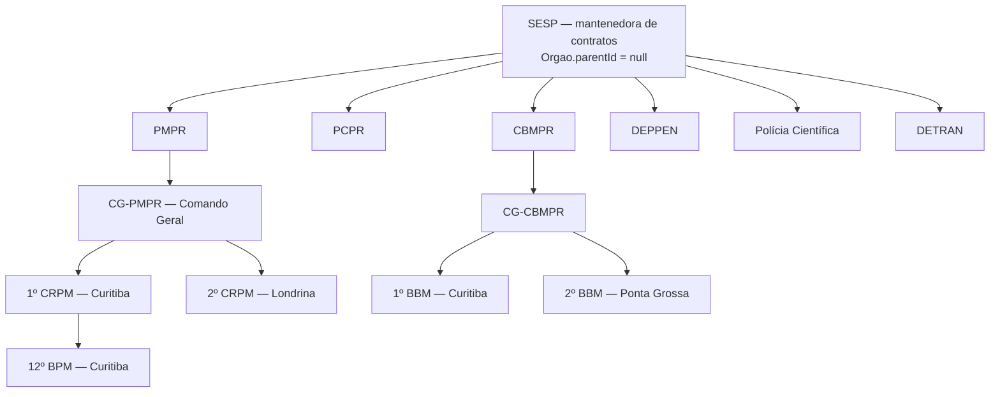

# 2026-08-05 — Hierarquia SESP, arquitetura de navegação e saneamento

Plano transversal (`packages/db`, `packages/schema`, `packages/domain`, `packages/ui`, `apps/api`, `apps/web`).
Sucede e não substitui: `apps/api/plan/2026-08-04_api_refatoracao_modelo_contratual.md` e `apps/web/plan/2026-08-04_frontend_refatoracao_contratual.md` (ambos concluídos).

---

## 0. O que NÃO pode regredir

Tudo abaixo está entregue, validado e é premissa de qualquer fase. Nenhuma fase pode fechar com um destes quebrados.

| Conquista | Onde vive | Teste que protege |
|---|---|---|
| Wizard de contrato em 8 etapas, rascunho + publicação, Ctrl+S | `apps/web/src/pages/ContractForm.tsx` (821 linhas), schemas por etapa em `packages/schema` | `apps/web/e2e` (smoke wizard) |
| Detalhe do contrato com 10 abas e `?tab=` | `apps/web/src/pages/ContractDetail.tsx` | e2e + navegação manual |
| Dashboards tático e estratégico (16 widgets, drill-down) | `Dashboard.tsx`, `DashboardEstrategico.tsx`, `useDashboard.ts` | testes de dashboard na API |
| Suíte da API verde (35 testes) | `apps/api/test` | `npm test` |
| a11y + Playwright/axe (4 chromium + 1 mobile) | `apps/web/e2e`, `playwright.config.ts` | `npm run test:e2e` |
| Seed curado: 5 exemplares por entidade, forças preservadas | `packages/db/seed_supabase.ts`, `packages/db/seed/orgaos.ts` | seed idempotente |
| LookupsProvider / LookupSelect / listas suspensas | `apps/web/src/features/dominios`, `/lookups` | testes de lookups |
| Contatos e sanções de fornecedor | `FornecedoresForm.tsx`, `/fornecedores/:id/contatos\|sancoes` | smoke API |

**Regra de ouro do plano:** toda rota que existe hoje continua respondendo — via componente ou via `Navigate`. Nenhum link salvo pelo usuário pode dar 404.

---

## 1. Correção conceitual: a hierarquia é SESP → forças → unidades

### 1.1 O erro que estamos corrigindo

A mensagem de commit anterior dizia *"substitui Unidades FSP por Orgao/UnidadeOrganizacional"*. Isso mistura dois conceitos:

- **FSP = Forças de Segurança Pública.** Não é legado, é a camada do meio do organograma. A tabela `UnidadeFsp` (plana, `sigla`/`nome`, 5 registros: PMPR, PCPR, CBMPR, DEPPEN, SESP) na verdade guardava **forças**, não unidades.
- **Unidade organizacional** é a hierarquia *interna* de cada força, que varia por força e é o que o usuário precisa cadastrar.

O que morre é a **tabela plana** `UnidadeFsp`. O conceito FSP permanece e ganha nome próprio no modelo.

### 1.2 Modelo alvo



Três níveis com papéis distintos:

1. **SESP** — topo administrativo, mantenedora dos contratos. Hoje está no seed como um `Orgao` *irmão* das forças (`tipo: ADMINISTRACAO_DIRETA`), sem relação de pai. **É isso que muda.**
2. **Forças (FSP)** — `Orgao` com `parentId = SESP`. Cada uma com `TipoOrgao` próprio. É a unidade de escopo do RBAC (`getOrgaoScope`).
3. **Subunidades** — árvore N-níveis dentro de cada força (`UnidadeOrganizacional.parentId`, já existe). **Cadastráveis pelo usuário e opcionais.**

### 1.2.1 Vocabulário (decidido em 2026-08-05)

> "UnidadeOrganizacional → são as Forças de Segurança + SESP"

Essa definição do negócio manda no modelo. **Unidade gestora de um contrato é uma força ou a própria SESP** — nunca um batalhão. Portanto:

| Termo de negócio | O que é | Model | Obrigatório no contrato |
|---|---|---|---|
| **Mantenedora** | SESP | `Orgao` raiz (`parentId = null`) | — |
| **Unidade gestora** | SESP ou uma das 6 forças | `Orgao` | **Sim** |
| **Subunidade** | CG, CRPM, BBM, delegacia, setor… (N níveis) | `UnidadeOrganizacional` | Não |

Consequência prática: `Contrato.unidadeGestoraId` **muda de alvo**, deixando de apontar para `UnidadeOrganizacional` (hoje aponta para a *sede*, ex.: `CG-PMPR`) e passando a apontar para `Orgao`. A subunidade vira um segundo campo, opcional. As sedes atuais (`CG-PMPR`, `DG-PCPR`…) continuam existindo, só que como primeiro nível de subunidade — deixam de ser um intermediário obrigatório.

### 1.3 Por que `Orgao.parentId` e não outra modelagem

| Alternativa | Veredito |
|---|---|
| **`Orgao.parentId` self-relation** (escolhida) | Migration de 1 coluna + backfill de 6 linhas. Preserva `TipoOrgao`, `@@unique([orgaoId, sigla])` e a FK `Contrato → UnidadeOrganizacional`. Reversível. |
| SESP vira nó raiz de `UnidadeOrganizacional` | Quebra a semântica de `@@unique([orgaoId, sigla])`, exige `orgaoId` nullable e reescreve o escopo por órgão. Alto risco, ganho zero. |
| Novo model `Mantenedora` acima de `Orgao` | Uma tabela de 1 linha. Overengineering. |

### 1.4 Tornar subunidade realmente opcional

Hoje `UnidadeOrganizacional` exige `municipioId` **e** `nivel` (`schema.prisma`), o que trava o cadastro rápido de um "5º CRPM" antes de se saber o município. E o enum `NivelUnidade` tem 8 valores fixos que **não** cobrem a nomenclatura de cada força (CRPM, BBM, Cadeia Pública, Núcleo Regional…).

| Campo | Hoje | Alvo | Motivo |
|---|---|---|---|
| `UnidadeOrganizacional.municipioId` | `String` NOT NULL | `String?` | Cadastro incremental; exibição herda do pai quando vazio |
| `UnidadeOrganizacional.nivel` | `NivelUnidade` NOT NULL (enum de 8) | **`NivelUnidade?`** (só opcional) | Decisão de 2026-08-05: adiar a nomenclatura por força. Ver §1.4.1 |
| `Contrato.unidadeGestoraId` | `String` NOT NULL → `UnidadeOrganizacional` | `String` NOT NULL → **`Orgao`** | Unidade gestora é a força ou a SESP (§1.2.1) |
| `Contrato.subunidadeId` | não existe | `String?` → `UnidadeOrganizacional` | Detalhamento opcional (CRPM, BBM, delegacia…) |

Migration mecânica, em uma transação:

1. `ALTER TABLE "Contrato" RENAME COLUMN "unidadeGestoraId" TO "subunidadeId"` e torna a coluna nullable (a FK para `UnidadeOrganizacional` continua válida, só muda de nome e de obrigatoriedade).
2. `ADD COLUMN "unidadeGestoraId"` com FK para `Orgao`, backfill `= (SELECT "orgaoId" FROM "UnidadeOrganizacional" u WHERE u.id = c."subunidadeId")`, depois `SET NOT NULL`.
3. Índice em `Contrato(unidadeGestoraId)`.

Ganho colateral relevante: hoje o escopo por órgão faz join `contrato.unidadeGestora.orgaoId` em **toda** listagem, export e busca (`getOrgaoScope`). Com a FK direta para `Orgao`, o filtro vira comparação de coluna indexada.

Ponto de atenção: as sedes deixam de ser intermediário obrigatório, então contratos existentes ficam com `subunidadeId` = sede antiga. Isso é *dado correto*, não sujeira — a sede continua sendo a subunidade responsável. Uma limpeza opcional (zerar `subunidadeId` quando ele aponta para a sede) fica fora do plano até você decidir.

#### 1.4.1 Nível da subunidade — decisão: só tornar opcional

Migrar `nivel` para `DominioValor` foi **adiado**. Nesta fase o campo apenas vira nullable. Consequências assumidas:

- O array `NIVEIS` hardcoded em `UnidadeForm.tsx:15-24` **permanece** por ora; entra na lista de pendências da Fase 9, não é resolvido agora.
- O enum `NivelUnidade` não cobre CRPM/BBM/Cadeia Pública. Enquanto não houver decisão, o cadastro de um "5º CRPM" fica com nível vazio, o que é aceitável porque `sigla` + `nome` + posição na árvore já identificam a unidade.
- Quando a nomenclatura for decidida, o caminho continua sendo o domínio `nivel-unidade` na tela de Listas suspensas, com backfill do enum. Tornar o campo opcional agora **não** cria dívida extra para esse caminho.

### 1.5 Seed

- SESP como raiz; 6 forças com `parentId = SESP`; 7 sedes (como hoje).
- **Não** vamos semear as subunidades em massa — a decisão anterior de "só sedes, subunidade é cadastro do usuário" continua valendo.
- Em vez disso, entregar `packages/db/seed/exemplos/unidades-pmpr-cbmpr.csv` com os 5 CRPM e 5 BBM do exemplo, para o usuário importar pela tela (valida o import de unidades da Fase 8).

### 1.6 Encerramento do legado `UnidadeFsp`

Depende de `contratoRepository.resolveUnidadeGestoraId`, que hoje resolve sigla FSP → órgão → sede. Ordem segura:

1. Front para de enviar `unidadeFspId` (Fase 3/9).
2. API para de emitir `unidadeFsp`/`unidadeFspId` no response (`contratoService.ts:72-78`).
3. Remove rotas `/references/unidades-fsp`, hooks `useUnidadesFsp*`, `qk.unidadesFsp`.
4. `DROP TABLE UnidadeFsp`.

Nomenclatura de UI: "Órgãos e unidades" → **"Estrutura organizacional"**, com a árvore SESP › Força › Unidade.

---

## 2. Arquitetura de navegação

### 2.1 O problema

12 itens planos na sidebar (`packages/ui/src/components/Sidebar.tsx:29-42`), sem grupos, sem gate por papel, misturando painel, cadastro, configuração e ação ("Novo contrato" é uma *ação*, não um lugar). O componente `Tabs` já existe e está provado em `ContractDetail` com `?tab=`; `Breadcrumbs` existe e tem **zero** uso em produção.

### 2.2 Sidebar alvo: 5 destinos

| # | Item | Rota | Abas (`?tab=`) | Papel mínimo |
|---|---|---|---|---|
| 1 | **Painel** | `/painel` | `tatico` · `estrategico` · `alertas` | VISITANTE |
| 2 | **Contratos** | `/contracts` | — (lista; "Novo" é ação primária) | VISITANTE |
| 3 | **Cadastros** | `/cadastros` | `fornecedores` · `servidores` · `catalogo` · `dotacoes` | VISITANTE (escrita: ANALISTA) |
| 4 | **Utilitários** | `/utilitarios` | `importacao` · `exportacao` | ANALISTA |
| 5 | **Configurações** | `/configuracoes` | `organizacao` · `listas` · `usuarios` · `seguranca` | GESTOR (usuarios/seguranca: ADMIN) |

Responde diretamente às suas três perguntas:

- **"Tudo o que for cadastrável em Configurações com tabs"** — dividido em dois, de propósito. *Cadastros* é dado de negócio que o analista mexe toda semana (fornecedor, servidor, item, dotação). *Configurações* é parametrização que muda raramente e é do gestor/admin (estrutura organizacional, listas suspensas, usuários, segurança). Juntar os dois faria uma tela com 8 abas e um gate de papel confuso.
- **"Painel tático, Estratégico e Alertas num painel central com subtabs"** — exatamente isso: `/painel?tab=`. Alerta é leitura operacional, pertence ao painel.
- **"Itens que carregam dropdown → utilitários?"** — não. As entidades que *alimentam* os dropdowns do contrato (fornecedor, servidor, catálogo, dotação) são **Cadastros**. *Utilitários* fica para operações sobre o acervo: importar e exportar.

### 2.3 Como implementar sem reescrever páginas

O ganho vem de composição, não de reescrita. Cada aba renderiza a **página que já existe, sem alteração**:

```tsx
// apps/web/src/pages/CadastrosPage.tsx  (novo, ~40 linhas)
const TABS = [
  { id: 'fornecedores', label: 'Fornecedores', Content: FornecedoresList },
  { id: 'servidores',   label: 'Servidores',   Content: ServidoresList },
  { id: 'catalogo',     label: 'Catálogo',     Content: CatalogoList },
  { id: 'dotacoes',     label: 'Dotações',     Content: DotacoesList },
] as const;
```

Regras que evitam retrabalho:

1. **Hook único `useTabParam(tabs, default)`** extraído do padrão já usado em `ContractDetail.tsx:56-72`. As duas telas passam a compartilhar; o comportamento de `ContractDetail` não muda.
2. **`?tab=` como convenção única** (não `?aba=`) — `ContractDetail` já usa, e um único nome evita bifurcação.
3. **Formulários continuam sendo rota própria** (`/fornecedores/new`, `/unidades/:id/edit`). Formulário dentro de aba destrói o deep-link e o botão voltar.
4. **`/contracts` não é renomeado.** Rota em inglês convivendo com grupos em português é uma inconsistência cosmética; renomear mexe em ~15 arquivos, na command palette, nos e2e e em links já salvos. Custo alto, benefício nulo.
5. **Radix Tabs desmonta aba inativa** por padrão — sem `forceMount`, não há custo de montar 4 listas juntas.

### 2.4 Sidebar: grupos + gate por papel

`NavItem` ganha dois campos opcionais:

```ts
type NavItem = {
  label: string;
  to: string;
  icon: LucideIcon;
  minRole?: Role;              // esconde o item abaixo do papel
  children?: { label: string; to: string }[];  // sub-itens contextuais
};
```

`children` só aparece quando a seção está ativa (progressive disclosure): você vê 5 itens, e ao entrar em Cadastros as 4 abas aparecem abaixo. Discoverability sem granularidade permanente.

`packages/ui` não pode importar `AuthProvider` (é um pacote de UI, sem dependência de app). O gate entra como prop: `<Sidebar canSee={(min) => hasMinRole(min)} />`.

### 2.5 Redirects (obrigatórios, sem exceção)

| De | Para |
|---|---|
| `/` | `/painel?tab=tatico` |
| `/estrategico` | `/painel?tab=estrategico` |
| `/alertas` | `/painel?tab=alertas` |
| `/fornecedores` · `/servidores` · `/catalogo-itens` · `/dotacoes` | `/cadastros?tab=…` |
| `/importacao` | `/utilitarios?tab=importacao` |
| `/unidades` · `/dominios` | `/configuracoes?tab=organizacao\|listas` |
| `/unidades-fsp*`, `/empresas*`, `/entidades-gestoras*`, `/servicos*` | já existem, mantidos |

`/contracts/new`, `/contracts/:id`, `/contracts/:id/edit`, `/*/new`, `/*/:id/edit` **não mudam**.

---

## 3. Chegar até o contrato

Hoje o detalhe é excelente e escondido: só se chega pela lista (protocolo ou botão Ver), por um card de alerta no dashboard e pela busca da command palette. Nenhum link no app aponta para uma aba específica.

| Melhoria | Onde | Nota |
|---|---|---|
| Linha inteira clicável na lista (não só o protocolo) | `ContractsList.tsx` | `role="link"` + `cursor-pointer`; preservar botões de ação com `stopPropagation` |
| **Breadcrumbs** — Contratos › GMS 456/2025 › Financeiro | `ContractDetail.tsx` usando `packages/ui/Breadcrumbs` | Componente pronto, 0 uso hoje |
| Deep-link por aba a partir do alerta | `AlertasList.tsx`, card do Dashboard | Publicação pendente → `?tab=publicidade`; vencimento → `?tab=resumo`; limite de acréscimo → `?tab=alteracoes` |
| "Vistos recentemente" (5 últimos, localStorage) | Painel tático + command palette sem digitar | Custo baixo, alto retorno diário |
| Command palette: contratos recentes + sub-comando de aba | `CommandPalette.tsx` | `GMS 456 › Financeiro` como item de resultado |
| Navegação anterior/próximo dentro do detalhe | `ContractDetail.tsx` | Opcional; útil em revisão em lote |

---

## 4. Autenticação, papéis e rastreabilidade

### 4.1 Papéis

Enum atual: `LEITOR · COLABORADOR · FISCAL · GESTOR · ADMIN`.

**Alvo (decidido em 2026-08-05): `ADMIN · GESTOR · ANALISTA · VISITANTE`.**

| Papel | Rank | Pode |
|---|---|---|
| `VISITANTE` | 1 | Ler painéis, contratos e cadastros dentro do seu escopo de órgão |
| `ANALISTA` | 2 | Criar/editar contratos, cadastros, importar e exportar |
| `GESTOR` | 3 | Tudo do analista + alterações contratuais + estrutura organizacional e listas suspensas |
| `ADMIN` | 4 | Tudo + usuários, domínios de e-mail e parâmetros de segurança |

`FISCAL` sai do RBAC — ser fiscal de um contrato é papel *contratual*, já modelado em `ContratoResponsavel`, não nível de acesso. Para efeito de permissão, fiscal é um analista com escopo de órgão.

Migration: adiciona `ANALISTA` e `VISITANTE` ao enum; backfill `COLABORADOR|FISCAL → ANALISTA` e `LEITOR → VISITANTE`; `normalizeRole` (`authTypes.ts`) continua aceitando os valores antigos por um release, depois eles são removidos. Atenção ao rank: as rotas hoje pedem `requireMinRole('COLABORADOR')` em ~6 arquivos e `GESTOR` em `alteracoes.ts` — o mapa novo precisa preservar exatamente essas fronteiras.

`RANK` está **duplicado** entre backend (`rbac.ts`) e front (`AuthProvider.tsx:24-30`); passa a vir de `packages/domain`.

### 4.2 Domínio de e-mail

Não existe nenhuma restrição hoje (`LoginSchema` só valida formato). Alvo:

- Allowlist em `Dominio`/`DominioValor` com slug `dominios-email-permitidos`, seed `sesp.pr.gov.br`. Reusa a infra de listas suspensas em vez de criar tabela nova, e ganha CRUD, auditoria e cache de graça.
- Validado em **dois pontos**: `POST /auth/login` e `POST /usuarios` (não adianta barrar o login se o admin cadastra qualquer e-mail).
- Só ADMIN edita, em Configurações › Segurança.
- Escape hatch: variável `AUTH_EMAIL_DOMAINS` sobrescreve em ambiente de dev/teste, para não travar os 35 testes e os e2e.

### 4.3 UI de usuários

API pronta (`GET/POST /usuarios`, `PATCH /usuarios/:id`, todos ADMIN), **zero** interface. Configurações › Usuários: lista com papel/órgão/situação, criar, trocar papel, vincular servidor e órgão, ativar/desativar via `PATCH ativo`. Falta na API apenas `GET /usuarios/:id`.

### 4.4 Guarda de rotas

Não existe `ProtectedRoute`. O padrão `!token || hasMinRole(...)` espalhado nas páginas trata **deslogado como permissivo**, espelhando o bypass de dev da API (`AUTH_REQUIRED` ≠ 1 → usuário `system` COLABORADOR). Isso é aceitável em dev e inaceitável em produção. Alvo: um `<RequireRole min="...">` no `App.tsx`, cujo comportamento permissivo fica atrás da mesma flag `AUTH_REQUIRED` que a API usa — um único interruptor para os dois lados.

### 4.5 Rastreabilidade do contrato

Existe `AuditLog` alimentado por **triggers Postgres** (`fn_audit_row`, `changedBy` via GUC `app.current_user`) em 10 tabelas, e a aba Auditoria já lê isso. O que falta é o essencial de estar visível:

- `Contrato.criadoPorId` / `Contrato.atualizadoPorId` (FK `Usuario`, nullable), preenchidos no repositório a partir de `requestContext`. Backfill a partir do `AuditLog` onde houver `changedBy`.
- No cabeçalho do detalhe: *"Criado por Fulano em 12/03/2025 · Última alteração por Ciclano há 2 dias"*, com link para a aba Auditoria.
- Coluna opcional "Última alteração" na lista.
- Remover o `writeAuditLog` app-level de `referenciaRepository.ts`, que **duplica** eventos das triggers em `Fornecedor`/`Servidor`.

---

## 5. Dotações e importação

### 5.1 Dotações

Tela é read-only (`DotacoesList.tsx`), CRUD completo existe na API (`/dotacoes`). Entregar:

- `DotacaoForm.tsx` + rotas `/dotacoes/new` e `/dotacoes/:id/edit`; ações de editar/excluir na lista.
- Natureza de despesa e fonte de recurso via `LookupSelect` (já são `DominioValor`).
- **Import CSV** (são inúmeras): nova entidade `dotacao` no motor de importação + `DotacaoImportLinhaSchema`. Dedup por `@@unique([exercicio, codigo])` com upsert.

### 5.2 Por que a importação "não funciona"

Diagnóstico pelo código (`ImportacaoWizard.tsx`, `importacaoRepository.ts`, `AuthProvider.tsx`):

| # | Causa | Evidência | Correção |
|---|---|---|---|
| 1 | **`canImport = hasMinRole('ADMIN')` e `hasMinRole` retorna `false` sem usuário** | `AuthProvider.tsx:88` — `RANK[user?.role ?? ''] ?? 0`. Deslogado (ou logado como gestor) desabilita **todos** os controles | Causa provável do sintoma. Mensagem com link direto para `/login` e estado explicando o papel atual |
| 2 | **`aplicar` não é transacional** | `importacaoRepository.ts:184-200` — loop de `create` sem transação. Documento duplicado → P2002 → 500 no meio, registros já criados, lote **não** marcado APLICADO | Envolver em `$transaction` e capturar erro por linha, gravando em `ImportacaoLinha.erros` |
| 3 | `dryRun` do input é ignorado | `importacaoRepository.ts:135,140` — sempre `situacao: 'VALIDADO'`, `dryRun: true` | Respeitar o flag; `RECEBIDO` quando não for dry-run |
| 4 | Sem upload de arquivo | Só `<Textarea>` com CSV colado | `<input type="file">` + `FileReader` no cliente, postando o texto. **Sem multer** — a API não muda |
| 5 | Só fornecedor e servidor | `validateLinha` | Adicionar `dotacao` e `unidade` (habilita o CSV de exemplo dos CRPM/BBM) |
| 6 | `GET /importacoes/:id` sem RBAC | `routes/operacao.ts` | `requireMinRole('ANALISTA')` |

XLSX de entrada fica para depois: parse no cliente com `xlsx` convertendo para as mesmas linhas JSON, sem tocar na API.

---

## 6. Exportação

Estado real: `GET /exports/contratos.xlsx` **devolve CSV** com `Content-Type` de Excel e nome `contratos.csv` — é um xlsx falso. Não há PDF. O único botão de export está em `ContractsList`.

| Entrega | Endpoint | Formato |
|---|---|---|
| Acervo (respeitando os filtros da lista **ou** tudo) | `GET /exports/contratos.{csv,xlsx}` | CSV real + XLSX real via `exceljs` |
| Ficha de um contrato | `GET /contracts/:id/export.{csv,xlsx,pdf}` | PDF via `pdfkit` (sem headless browser) |

- UI: dropdown "Exportar" no detalhe do contrato (3 formatos) e aba Utilitários › Exportação com escopo (filtros atuais / todos) e formato.
- Escopo por órgão aplicado nos dois caminhos — export é o vazamento de dados mais fácil de esquecer.
- Conteúdo do PDF: identificação, fornecedor, vigência, valores, responsáveis, últimas alterações e rodapé com data de emissão e usuário.

---

## 7. Dívida de tipagem e boilerplate

Números levantados na auditoria:

| Sintoma | Medida |
|---|---|
| Interfaces manuais no front que espelham entidades da API | **17** em 4 arquivos de hooks (+ `Dotacao` inline em `DotacoesList.tsx`) |
| `invalidateQueries` espalhados | **57** ocorrências |
| Hooks exportados / mutations CRUD | 57 / 27 |
| Services 100% pass-through | `orgaoService` (12/12), `partesService` (17/17), `catalogoService` (13/15), `dashboardService` (14/18) |
| Arrays de enum hardcoded no front | **8** (`NIVEIS`, `TIPOS_SANCAO`, pilar, natureza, tipos de alteração…) |
| Casts `as never` / `any` | ~52 na API, 7 no web |
| Formatação de moeda inline | 10 `toLocaleString` em 5 páginas, com `formatCents` pronto em `packages/domain` |
| Arquivos > 400 linhas | `ContractForm` 821, `ContractDetail` 680, `contratoRepository` 521, `FornecedoresForm` 451 |

Causa raiz da duplicação de tipos: **`packages/schema` só exporta tipos de entrada** (`*CreateInput`, `*UpdateInput`). Não há DTO de resposta, então cada hook redeclara a entidade à mão.

Ordem de ataque (impacto ÷ risco):

1. **DTOs de resposta em `packages/schema`** — `ContratoDTO`, `ContratoDetailDTO`, `FornecedorDTO`, `UnidadeDTO`, `DotacaoDTO`, `DashboardKpisDTO`. Web deleta as 17 interfaces; API tipa o retorno dos services. Elimina a maior fonte de divergência silenciosa.
2. **Factory `createCrudHooks({ resource, keys, alsoInvalidate })`** — ~300 LOC a menos em `useReferences.ts` e um só lugar decidindo invalidação. O helper `invalidateFornecedorDetail` já é um refactor começado e não generalizado.
3. **Labels de enum em `packages/domain`** para todos os enums (hoje só `PILAR_LABELS` e `NATUREZA_OBJETO_LABELS`) — mata os 8 arrays hardcoded. `NivelUnidade` some junto com a migração para domínio (§1.4).
4. **`RANK` de papéis unificado** em `packages/domain`, consumido por `rbac.ts` e `AuthProvider`.
5. **Formatadores**: só `packages/domain/money.ts`. Regra de lint proibindo `toLocaleString` com `currency` fora dele.
6. **Aliases legados**, nesta ordem exata: front para de ler fallback → API para de emitir → schema remove `@deprecated`. Hoje são **3 camadas** de compatibilidade (transform no schema → map no service → fallback na UI).
7. **Páginas legadas mortas**: `EmpresasList/Form`, `EntidadesGestoras*`, `Servicos*` — não roteadas e com **imports quebrados** (`useDeleteEmpresa` não existe). Deletar.
8. **Services pass-through**: manter a camada (consistência arquitetural) mas gerar com `makeCrudService(repo, schemas)` em vez de 56 métodos manuais.
9. **UI**: `Input.label` e `FormField.label` são duas APIs para o mesmo layout — escolher uma. `Tabs` com API compound (`Tabs.List`/`Tabs.Trigger`) fica como opcional, só se a Fase 3 pedir.

`ContractForm` (821 linhas) **não** será refatorado neste plano. Funciona, está protegido por e2e, e o ganho de quebrá-lo não compensa o risco. Só entra se uma fase precisar tocar nele por outro motivo.

---

## 8. Faseamento

Cada fase é entregável e reversível sozinha. Nenhuma fase começa com a anterior vermelha.

| Fase | Escopo | Migration | Risco | Critério de pronto |
|---|---|---|---|---|
| **0. Rede de proteção** | Dump do banco; `npm test` (35) + `test:e2e` verdes; inventário de rotas congelado | — | — | Baseline registrado neste arquivo |
| **1. Hierarquia SESP** | `Orgao.parentId`; backfill 6 forças → SESP; `/orgaos/arvore`; seed | sim (aditiva) | baixo | Árvore SESP › Força › Subunidade na API e na tela |
| **2. Unidade gestora = força** | `unidadeGestoraId` → `Orgao`; `subunidadeId` opcional; `municipioId` e `nivel` nullable; escopo direto | sim (2 migrations) | **alto** | Contrato salva só com a força; 35 testes verdes; escopo por órgão idem |
| **3. Navegação** | Sidebar com grupos + gate; 4 páginas de seção; `useTabParam`; todos os redirects | não | médio | Toda rota antiga responde; e2e atualizado |
| **4. Exportação** ⭐ | XLSX real (`exceljs`); PDF (`pdfkit`); ficha por contrato + acervo; UI com escopo | não | baixo | 3 formatos por contrato e do acervo, respeitando escopo por órgão |
| **5. Descoberta** | Breadcrumbs; linha clicável; deep-link por aba; recentes; palette | não | baixo | Chegar ao detalhe em ≤ 2 cliques de qualquer painel |
| **6. Auth** | `ANALISTA`/`VISITANTE`; allowlist de domínio; UI de usuários; `RequireRole` | sim (enum) | médio | Login barra domínio externo; admin gerencia domínios e usuários |
| **7. Rastreabilidade** | `criadoPorId`/`atualizadoPorId` + backfill; header do detalhe; fim da auditoria duplicada | sim (aditiva) | baixo | Detalhe mostra autoria; sem evento duplicado |
| **8. Dotações + importação** | Form de dotação; entidades `dotacao`/`unidade` no import; transação; upload de arquivo; RBAC no GET | não | médio | Importar os 5 CRPM por CSV; lote com duplicata não corrompe |
| **9. Saneamento** | DTOs; factory de hooks; labels de enum; aliases; páginas mortas; `NIVEIS` hardcoded | não | médio | Zero interface duplicada; `invalidateQueries` centralizado |

⭐ Exportação foi promovida a Fase 4 por decisão de 2026-08-05.

**Caminho crítico:** 1 → 2 → 3. As fases 4 a 8 são independentes entre si e podem ser reordenadas conforme urgência. A 9 vem por último de propósito: fazer DTOs antes das mudanças de modelo das fases 1-2 seria retrabalho garantido.

Uma dependência a respeitar: a **Fase 4 depende da 2**, porque a ficha exportada mostra unidade gestora e subunidade. Exportar antes da migração significaria refazer o layout do PDF e as colunas do XLSX.

### Rollback

- Migrations aditivas (1, 6): `DROP COLUMN`, sem perda.
- Fase 2: as duas migrations mantêm `unidadeGestoraId` populado durante a transição, então reverter é restaurar o NOT NULL. **Dump obrigatório antes.**
- Fase 3: só front. Reverter = restaurar `navItems` e as rotas diretas; as páginas em si não foram tocadas.
- Fase 6: enum aditivo; `normalizeRole` continua aceitando os valores antigos.

---

## 9. Decisões

### Tomadas em 2026-08-05

| Tema | Decisão | Impacto no plano |
|---|---|---|
| **Papéis** | `ADMIN · GESTOR · ANALISTA · VISITANTE`; fiscal deixa de ser papel de acesso | §4.1 reescrito; `LEITOR → VISITANTE` no backfill |
| **Unidade gestora** | É a força ou a própria SESP, não a sede. Subunidade é opcional | §1.2.1 e §1.4: `Contrato.unidadeGestoraId` passa a apontar para `Orgao`; nasce `subunidadeId` |
| **Nível da subunidade** | Só tornar opcional agora; nomenclatura por força fica para depois | §1.4.1; `NIVEIS` hardcoded segue vivo até a Fase 9 |
| **Prioridade pós 1-3** | Exportação primeiro | Exportação promovida a Fase 4 |

### Em aberto

1. **PDF** — ficha de 1 página por contrato, ou relatório completo com itens, alterações e empenhos? *(decidir antes da Fase 4)*
2. **Contratos legados** — depois da Fase 2, zerar `subunidadeId` nos contratos em que ele aponta para a sede do órgão, ou manter a sede como subunidade responsável? *(default: manter)*
3. **Nomenclatura de subunidade** — quando voltar ao tema, a lista é única para todas as forças ou uma por força? *(decidir na Fase 9)*

---

## 10. Baseline (Fase 0)

Preencher ao iniciar a execução.

- Commit base: `_______`
- `npm test` (API): `__/35`
- `npm run test:e2e`: `__ chromium / __ mobile`
- Dump: `_______`
- Rotas registradas hoje: 37 (incluindo 9 redirects) — inventário em `apps/web/src/App.tsx`
