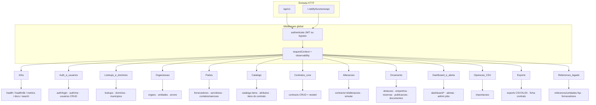
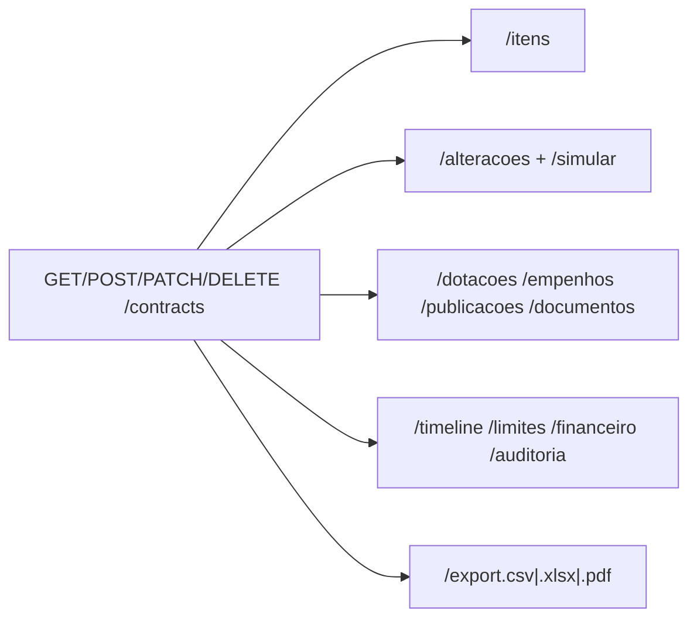
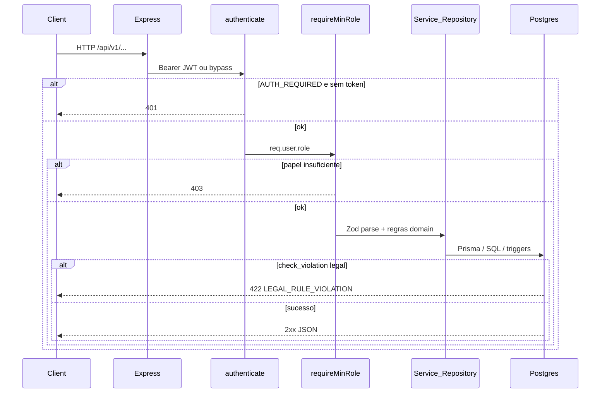

# 1 — Mapa de recursos da API

> Documento vivo. Fonte de verdade operacional: `apps/api/src/index.ts` + `apps/api/src/lib/apiCatalog.ts` + `GET /api/v1/docs`.

## O que estamos construindo

Uma API JSON **única** (Express) que:

- Serve o painel React em desenvolvimento (proxy Vite → `:8888`).
- Pode ser empacotada como Netlify Function (`serverless-http`) — por isso o **alias** `/.netlify/functions/api`.
- Autentica **quase tudo** com middleware global (`authenticate`), depois aplica **RBAC por rota** (`requireMinRole`).
- Encoda regras da Lei 14.133 no domínio (`@painel/domain`: limites de aditivo) e no Postgres (triggers, ex. fundamento legal em DISPENSA).

## Visão em blocos (não endpoint a endpoint)

## Bloco × capacidade × escrita mínima

Papéis: `VISITANTE < ANALISTA < GESTOR < ADMIN` (`ROLE_RANK` em `@painel/domain`).

| Bloco | Capacidade (o que entrega) | Leitura típica | Escrita mínima |
|-------|----------------------------|----------------|----------------|
| Infra | Liveness, OpenAPI, métricas | público / autenticado | — |
| Auth | Login JWT, `/me`, CRUD usuários | `/me` autenticado | **ADMIN** usuários |
| Lookups / domínios | Listas suspensas, municípios IBGE | VISITANTE+ | **ADMIN** valores de domínio |
| Organização | Órgãos SESP/forças, unidades, árvore | VISITANTE+ | **GESTOR** |
| Partes | Fornecedor unificado, servidores | VISITANTE+ | **ANALISTA** |
| Catálogo | Itens padronizados + itens no contrato | VISITANTE+ | **ANALISTA** |
| Contratos | Núcleo: GMS, pilar, vigência, responsáveis, rateio | VISITANTE+ | **ANALISTA** CUD |
| Alterações | Aditivos / apostilamentos + simulação legal | VISITANTE+ | **GESTOR** |
| Orçamento | Dotação, empenho, publicação, documento | VISITANTE+ | **ANALISTA** |
| Dashboard / alertas | KPIs, MVs, timeline, limites, jobs | VISITANTE+ (escopo órgão) | **ADMIN** jobs |
| Operação | Importação CSV em lotes | — | **ANALISTA** import; **ADMIN** gerar-alertas |
| Exports | Planilhas e ficha PDF | — | **ANALISTA** |
| References | Compat legado (unidades-fsp…) | legado | preferir rotas novas |

## Nested sob `/contracts/:id`

O contrato é o **agregado raiz**. Vários routers “penduram” no mesmo `:id`:

**Didática:** listar contratos é barato; abrir o detalhe dispara várias queries React Query (financeiro, limites, timeline…). Isso é intencional para abas — não um “fat DTO” único.

## Pipeline de uma requisição

## Bypass de desenvolvimento (capacidade e armadilha)

| `AUTH_REQUIRED` | Sem `Authorization` | Efeito |
|-----------------|---------------------|--------|
| off (padrão local) | usuário sistema **ADMIN** | UI e API liberadas — bom para estudar; **não** é produção |
| `1` / `true` | 401 | espelha `VITE_AUTH_REQUIRED` no front |

Tokens sintéticos de teste (Vitest): `Bearer admin|gestor|analista|visitante`.

## Limitações conscientes (estudar!)

1. **Dois mounts** (`/api/v1` e Netlify) — mesmos handlers; cuidado ao documentar URLs.
2. **Escopo por órgão** (`orgaoId` do usuário) — listagens/dashboard filtram; ADMIN vê tudo. Ainda há MVs “globais” em evolução.
3. **References legado** — parte desmontada (`empresas`, etc.); `unidades-fsp` pode permanecer por compat.
4. **Regras legais** — parte no TypeScript (`simularAlteracao`), parte no SQL (fundamento). Erros de negócio → **422**, não 500.
5. **OpenAPI** expandido, mas o mapa mental útil continua sendo este agrupamento por bloco.

## Onde aprofundar no código

- Mount: [`apps/api/src/index.ts`](../../apps/api/src/index.ts)
- Catálogo: [`apps/api/src/lib/apiCatalog.ts`](../../apps/api/src/lib/apiCatalog.ts)
- Auth: [`apps/api/src/middleware/auth.ts`](../../apps/api/src/middleware/auth.ts)
- RBAC: [`apps/api/src/middleware/rbac.ts`](../../apps/api/src/middleware/rbac.ts)
- Limites legais: [`packages/domain/src/limites.ts`](../../packages/domain/src/limites.ts)
