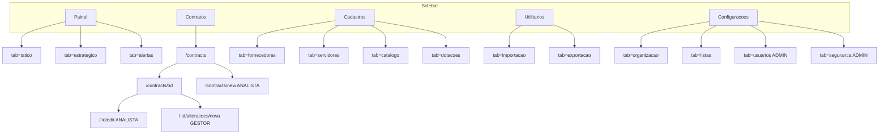
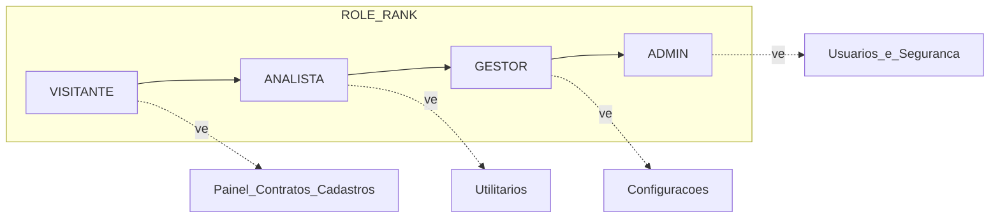
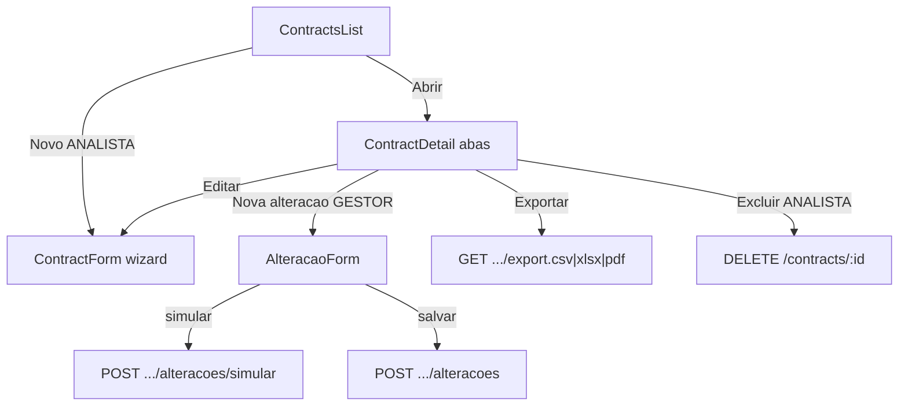
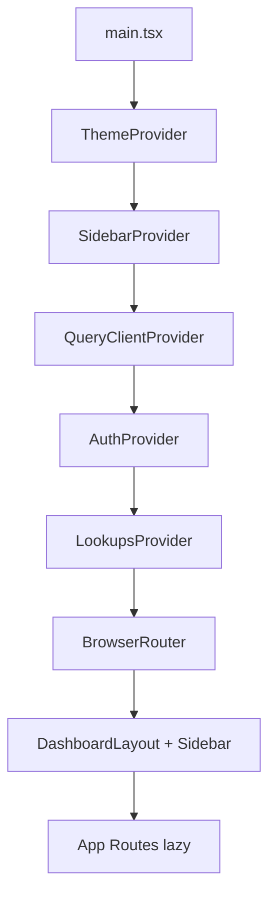

# 2 — Mapa do frontend (Sidebar → impacto)

> Documento vivo. Fonte: [`packages/ui/src/components/Sidebar.tsx`](../../packages/ui/src/components/Sidebar.tsx) + [`apps/web/src/App.tsx`](../../apps/web/src/App.tsx) + páginas hub (`PainelPage`, `CadastrosPage`, …).

## Ideia de produto na navegação

A Sidebar não lista “todas as telas”: ela agrupa **cinco atividades** do gestor contratual. Rotas antigas (`/fornecedores`, `/dominios`, `/estrategico`…) **redirecionam** para hubs com `?tab=`.

## Visibilidade por papel (Sidebar)

`canSeeNav` + `minRole` no item. Com `VITE_AUTH_REQUIRED` **off**, tudo aparece (bypass). Com auth **on**:

| Item Sidebar | `minRole` item | Sub-itens extras |
|--------------|----------------|------------------|
| Painel | — (todos) | — |
| Contratos | — | writes na página, não no menu |
| Cadastros | — | forms `/new` exigem ANALISTA |
| Utilitários | **ANALISTA** | import/export |
| Configurações | **GESTOR** | Usuários / Segurança = **ADMIN** |

## Atividade → impacto (o que “acontece de verdade”)

### 1. Painel

| Tab | Página | Impacto de negócio | APIs típicas |
|-----|--------|--------------------|--------------|
| Tático | `Dashboard` | KPIs operacionais, vencimentos | `GET /dashboard/kpis`, `/vencimentos` |
| Estratégico | `DashboardEstrategico` | Visões das “16 perguntas” (órgão, custos, frota…) | `GET /dashboard/por-orgao`, `/custos`, … |
| Alertas | `AlertasList` | Reconhecer / gerar alertas | `GET /alertas`, `POST .../reconhecer`, job ADMIN |

**Capacidade:** leitura rápida para decisão.  
**Limitação:** várias MVs ainda pouco filtradas por órgão; refresh analytics é job **ADMIN**.

### 2. Contratos (coração do sistema)

Abas do detalhe (resumo, timeline, itens, alterações, financeiro, fiscalização, rateio, publicidade, documentos, auditoria) **puxam endpoints nested** sob o mesmo contrato.

**Capacidade:** ciclo de vida + aditivos com simulação legal.  
**Limitação:** aditivo de prazo exige data **posterior** à vigência atual; DISPENSA exige `fundamentoLegalId` (trigger PG → 422).

### 3. Cadastros

Hub `CadastrosPage` com tabs; CRUD real nas rotas `/fornecedores|servidores|catalogo-itens|dotacoes/...`.

| Tab | Impacto | Write |
|-----|---------|-------|
| Fornecedores | Parte contratual (CNPJ/CPF), contatos, sanções | ANALISTA |
| Servidores | Gestores/fiscais (pessoas), não “entidade gestora” | ANALISTA |
| Catálogo | Itens padronizados → itens do contrato | ANALISTA |
| Dotações | Orçamento vinculado a contratos | ANALISTA |

**Didática:** “Cadastros” alimentam lookups e FKs do contrato. Sem fornecedor/servidor/órgão bons, o wizard de contrato trava.

### 4. Utilitários (ANALISTA+)

| Tab | Impacto |
|-----|---------|
| Importação | CSV → staging → aplicar (`/importacoes`) |
| Exportação | Extração em massa (`/exports/contratos.csv|.xlsx`) |

**Limitação:** import é caminho poderoso — papel mínimo ANALISTA de propósito.

### 5. Configurações (GESTOR+)

| Tab | Impacto | Write |
|-----|---------|-------|
| Estrutura | Órgãos / unidades (organograma SESP) | GESTOR |
| Listas suspensas | Domínios (modalidade, fundamento…) | **ADMIN** escreve valores |
| Usuários | Papel, órgão, servidor vinculados | ADMIN |
| Segurança | Allowlist de e-mail de login | ADMIN |

## Shell da aplicação

- **LookupsProvider**: cache ~30 min de `GET /lookups` — Select/LookupSelect dependem disso.
- **AuthProvider**: `localStorage.auth_token` + `/auth/me`.
- **Lazy routes**: code-split por página.

## Rotas legadas → hub

Redirecionamentos em `App.tsx` evitam bookmarks quebrados:

| Antiga | Nova |
|--------|------|
| `/estrategico`, `/alertas` | `/painel?tab=...` |
| `/fornecedores`, `/servidores`, `/catalogo-itens`, `/dotacoes` | `/cadastros?tab=...` |
| `/importacao` | `/utilitarios?tab=importacao` |
| `/unidades`, `/dominios` | `/configuracoes?tab=...` |
| `/empresas`, `/entidades-gestoras`, `/servicos` | cadastros unificados |

## Como estudar na prática

1. Suba API + web; login `visitante@` / `analista@` / `gestor@` / `admin@` (seed).
2. Com `VITE_AUTH_REQUIRED=1`, observe itens sumindo na Sidebar.
3. Em Contratos → detalhe, abra Network: cada aba ≈ um recurso nested da API (#1).
