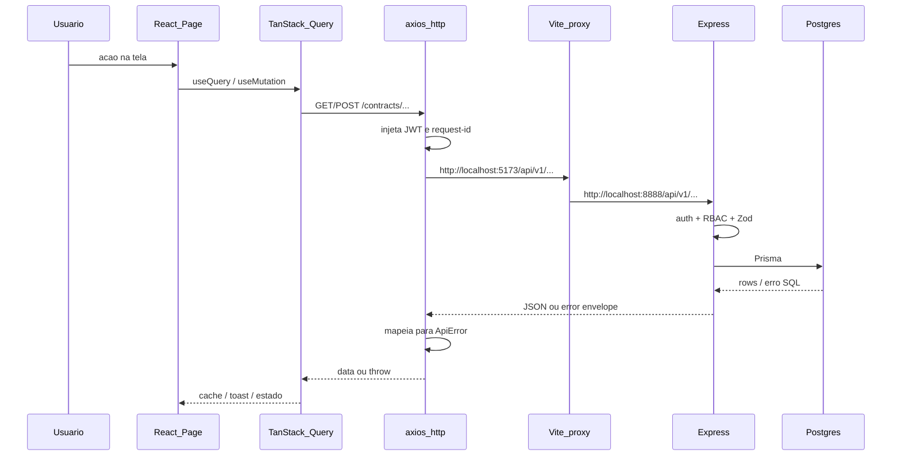
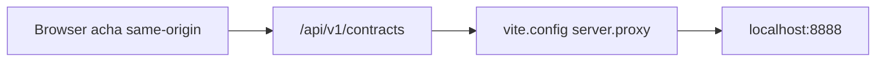
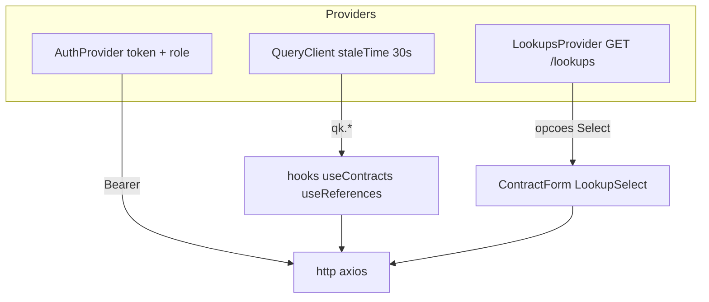
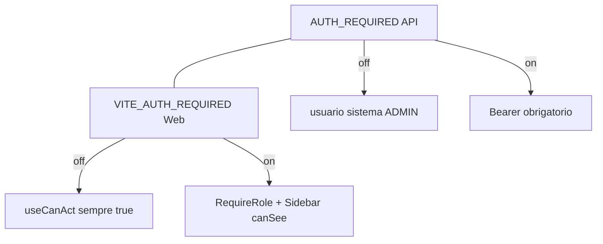

# 3 — Como o frontend fala com o backend

> Documento vivo. Fontes: [`apps/web/src/lib/http.ts`](../../apps/web/src/lib/http.ts), [`apps/web/vite.config.ts`](../../apps/web/vite.config.ts), [`apps/web/src/main.tsx`](../../apps/web/src/main.tsx), middleware API.

## Foto da stack de comunicação

```text
Browser (React)
    │  axios  baseURL = VITE_API_URL ?? "/api/v1"
    │  + Authorization: Bearer <jwt>
    │  + x-request-id
    ▼
Vite dev (:5173)  ──proxy──►  Express API (:8888)
    │                            │
    │  mesma origem no browser   │  authenticate → rbac → service → Prisma
    ▼                            ▼
  UI /assets                   Postgres (:5434 Docker)
```

Em **produção** (ex. Netlify), o front pode apontar `VITE_API_URL` para a Function `/.netlify/functions/api` — o app Express monta **os dois** prefixos.

## Fluxo ponta a ponta



## Camada HTTP (`http.ts`) — o que ela garante

| Responsabilidade | Comportamento |
|------------------|---------------|
| Base URL | `import.meta.env.VITE_API_URL` ou `/api/v1` (relativo → proxy) |
| Timeout | 15 s → `ApiError TIMEOUT` |
| Auth | Lê `localStorage.auth_token` → header `Authorization` |
| Correlação | `x-request-id` por chamada (logs da API) |
| Erros | Envelope `{ error: { code, message, details } }` → `ApiError` |
| Rede | Sem response → `NETWORK_ERROR`; 503 → banco indisponível |

**Didática:** páginas **não** usam `fetch` solto; passam por `http` + hooks (`useContracts`, `useDominio`, …) para erros e cache uniformes.

## Proxy Vite (por que “5173/api/…” aparece no DevTools)



Sem proxy, CORS e cookies complicariam o dev. Em Codespaces: encaminhe **5173** (UI) e garanta API no **8888** (ou ajuste `VITE_API_URL`).

## Estado no cliente



| Peça | Papel |
|------|--------|
| React Query | Cache, retry, invalidação (`invalidateContratos`, …) |
| LookupsProvider | Domínios/órgãos “quentes” para selects (30 min) |
| AuthProvider | Sessão; `hasMinRole` para Sidebar e `RequireRole` |
| `@painel/schema` | Tipos DTO + Zod de create/update compartilhados com a API |
| `@painel/domain` | Papéis, labels, `simularAlteracao` (espelhado na API) |

## Auth: dois interruptores que devem casar



Login: `POST /auth/login` → token → `localStorage` → próximas calls autenticadas.  
`GET /auth/me` hidrata papel/órgão.

## Erros que você vê no console (tradução)

| Sintoma | Camada | Significado |
|---------|--------|-------------|
| 404 `Contract not found` | API | ID inexistente / já deletado |
| 403 Forbidden | RBAC | Papel &lt; mínimo da rota (ex. ANALISTA em alteração) |
| 422 `LEGAL_RULE_VIOLATION` | Domain/SQL | Aditivo inválido, fundamento ausente, etc. |
| 401 | Auth | Token ausente/ inválido com AUTH on |
| Network / proxy error | Vite↔API | API caída ou porta errada |

## Capacidades

- Contrato tipado compartilhado (menos drift front/back).
- Simulação de aditivo **antes** de gravar (mesmo motor domain na API).
- Observabilidade básica (`request-id`, `/metrics`).
- Deploy flexível (Node longo ou Function Netlify).

## Limitações / cuidados

1. **Token só no `localStorage`** — XSS = sessão roubada; aceitável em intranet, frágil na internet aberta.
2. **Bypass AUTH** deixa o sistema “aberto” — ótimo para estudar, péssimo se Codespace público sem flag.
3. **Invalidate agressivo** — delete de contrato precisa `removeQueries` no detalhe (já tratado) para não refetch 404.
4. **Lookups stale** — após CRUD de domínio, invalidar lookups; senão Select mostra lista velha.
5. **Uma React só** — monorepo fixou React 18; duplicar React quebra Radix (Select/Popover).

## Mini-roteiro de estudo com DevTools

1. Network → filtrar `api/v1`.
2. Login → veja `auth/login` + `auth/me` + header Bearer nas seguintes.
3. Abra um contrato → observe rajada de GETs nested.
4. Como GESTOR, simule alteração → `POST .../simular` (200 + `ok`/`erros`) depois `POST .../alteracoes`.
5. Como ANALISTA, tente o mesmo → 403 (UI também esconde o botão).

## Arquivos-chave

| Arquivo | Por quê |
|---------|---------|
| `apps/web/src/lib/http.ts` | Cliente único |
| `apps/web/vite.config.ts` | Proxy e aliases de packages |
| `apps/web/src/lib/access.ts` | Gates de UI |
| `apps/web/src/components/RequireRole.tsx` | Gates de rota |
| `apps/api/src/middleware/auth.ts` | JWT / bypass |
| `apps/api/src/index.ts` | Mount `/api/v1` + Netlify |
